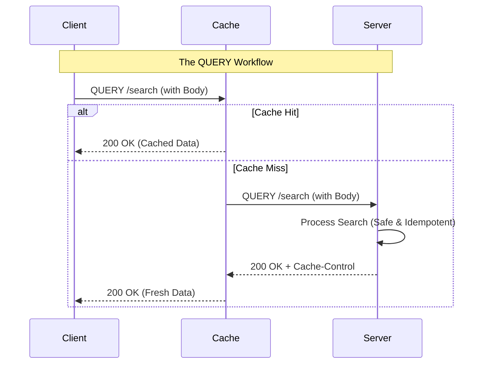

We have all been there. You are building a search feature or a complex filter. You want to send a large set of parameters to the server. You start with a `GET` request, but soon your URL looks like a chaotic string of encoded gibberish that hits the 2,048 character limit of some legacy proxy.

So, you do what every developer does. You switch to `POST`.

It works, but it feels wrong. `POST` is meant for creating resources or changing state. It is not idempotent by default, and browsers will nag users with "Are you sure you want to resubmit this form?" if they hit refresh. Plus, caches like Cloudflare often ignore `POST` bodies, meaning your expensive search query hits the database every single time.

Enter **RFC 9435: The HTTP QUERY Method**.

## The Missing Middle

The `QUERY` method is designed specifically for "safe" and "idempotent" data retrieval that requires a request body. It is the middle ground we have been waiting for. It has the body of a `POST` but the soul of a `GET`.

### Why is this a big deal?

1.  **No More URI Bloat**: You can send kilobytes of complex JSON or SQL-like filters without worrying about URL length limits.
2.  **Safety First**: Like `GET`, a `QUERY` is safe. It does not change anything on the server.
3.  **Idempotency**: Making the same request twice is guaranteed to give the same result without side effects.
4.  **Better Caching**: Because it is safe and idempotent, CDNs and browsers can cache the response based on the request body.

## How It Works

Here is a look at what a raw `QUERY` request looks like. Notice how we are sending a JSON payload but using the `QUERY` verb.

```http
QUERY /api/v1/products/search HTTP/1.1
Host: api.buildwithmanish.com
Content-Type: application/json
Accept: application/json

{
  "filters": {
    "category": "electronics",
    "price_range": [500, 1500],
    "tags": ["oled", "4k", "gaming"],
    "specs": {
      "refresh_rate": "120Hz",
      "panel": "IPS"
    }
  },
  "sort": "price_desc",
  "limit": 50
}
```

The server responds just like it would to a `GET` request:

```http
HTTP/1.1 200 OK
Content-Type: application/json
Cache-Control: public, max-age=3600
Vary: Content-Type

[
  { "id": "p123", "name": "UltraWide Gaming Monitor", "price": 899 },
  ...
]
```

## Implementing it in the Real World

While browser support for the `QUERY` method is still early, the specification is solid. If you are building internal microservices or using modern edge workers, you can start looking at this today.

### The Client Side

Using the standard `fetch` API, a `QUERY` request is straightforward. Just remember that many older servers might reject this verb until they are updated.

```javascript
async function searchProducts(criteria) {
  try {
    const response = await fetch('https://api.example.com/search', {
      method: 'QUERY', // The star of the show
      headers: {
        'Content-Type': 'application/json',
        'Accept': 'application/json'
      },
      body: JSON.stringify(criteria)
    });

    if (!response.ok) {
      throw new Error(`Search failed: ${response.status}`);
    }

    const data = await response.json();
    return data;
  } catch (error) {
    console.error('Error fetching data:', error);
  }
}

// Usage
const results = await searchProducts({
  minStars: 4,
  inStock: true,
  brand: "Logitech"
});
```

### The Server Side (Node.js Example)

If you are using a modern framework or raw Node.js, you can handle the `QUERY` method by checking the `req.method`.

```javascript
import { createServer } from 'http';

const server = createServer((req, res) => {
  if (req.method === 'QUERY' && req.url === '/search') {
    let body = '';
    req.on('data', chunk => { body += chunk; });
    
    req.on('end', () => {
      const params = JSON.parse(body);
      console.log('Safe and Idempotent Query Received:', params);
      
      res.writeHead(200, { 'Content-Type': 'application/json' });
      res.end(JSON.stringify({ message: "Results found", data: [] }));
    });
  } else {
    res.writeHead(405); // Method Not Allowed
    res.end();
  }
});

server.listen(3000);
```

## Visualizing the Flow

Here is how the `QUERY` method fits into the standard request lifecycle compared to `GET` and `POST`.



## Is it ready for prime time?

The `QUERY` method is a major win for API design. It fixes the "Search-POST-Hack" that has plagued RESTful architectures for years. While you might need to check your infrastructure (load balancers, WAFs, and proxies) to ensure they do not strip out the body of a `QUERY` request, the path forward is clear.

Stop forcing `GET` to carry heavy payloads, and stop using `POST` for safe operations. Give `QUERY` a try when you need to fetch data with a complex set of requirements. It is cleaner, safer, and ultimately more human.
