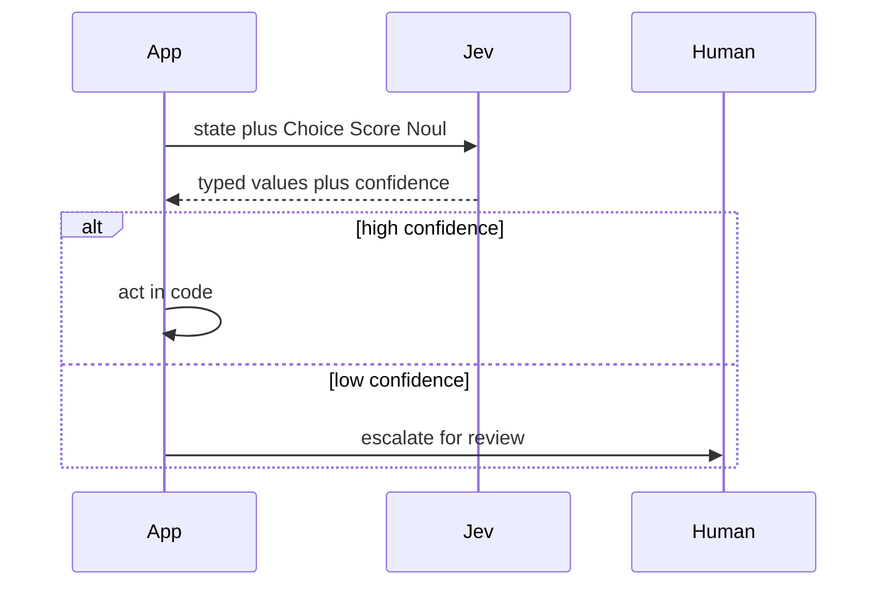

Software does not need another chatbot. It needs **a judge**.

That is the bet behind Jev. It was launched on September 15 2026 by TypeSafe AI as the **first public System One model**. Instead of writing paragraphs it reads messy state and returns **typed decisions that code can branch on directly**. No parsing. No schema repair. No free form prose to validate.

If you build agents or automation with many small semantic checks then this model deserves a close look. This post breaks down how it works and where it wins and where it fails and how to use it in production.

## The problem with LLMs as judges

Modern agents make **hundreds of micro decisions**. Route this ticket. Block this tool call. Score this risk. Check if this task is done. Grade this output. Pick the next model.

Teams often send each check to a frontier LLM and ask for JSON. That works but it hurts in three ways.

First is **latency**. TypeSafe measured **3 to 329 seconds end to end** for frontier models on automation workflows. Token by token generation dominates. You cannot put that in a hot loop or a real time interaction.

Second is **cost**. Frontier pricing sits near **0.20 to 10 dollars per million input tokens** plus output at roughly **5x input rates**. A thousand small checks per hour adds up fast.

Third is **trust**. Confidence asked for in prose is often **overconfident and inconsistent**. Parsing can fail. A valid JSON shape can still hold a wrong judgment. You get text when you wanted **a value**.

Jev attacks all three by changing the interface.

## What is Jev

Jev is a **hosted decision model**. You send **state plus typed questions**. It returns **typed answers plus probabilities**.

State is any messy context. It can be a customer message or logs or alerts or an agent trace or policy text. Questions define the exact shape of the answer in advance. Jev evaluates **all questions against the same state in parallel** and returns **one call with many answers**.

Live build is **Jev 1.13** also called **jev-1.13.0**. Input costs **0.042 dollars per million tokens** which is **42 dollars per billion**. **Output is free** because there is no token stream to meter. Context is **64k tokens per request** with about **32k for state** plus the longest question. TypeSafe reports **70 to 500 ms end to end** with most queries near **100 ms**. Rate limits move during early access and sit near **250000 tokens per second** and **1200 requests per minute**.

English is strongest today. **Pin jev-1.13.0 if you tune thresholds**. Use jev-latest only for exploration.

## State in typed decisions out

Every call has two parts.

**State holds facts. Questions hold intent. Code holds action.**

Here is a support routing example.

```python
import os
import requests

API_KEY = os.getenv("TYPESAFE_API_KEY")
API_URL = "https://api.typesafe.ai/v1/decisions"

state = {
  "customer_message": "I was charged twice for order ord_7429",
  "amount_usd": 680,
  "identity_verified": True,
  "policy": "Refunds above 500 need human approval"
}

questions = {
  "action": {
    "type": "choice",
    "instructions": "Choose the safest next action",
    "criteria": {
      "allow": "Issue refund now",
      "review": "Require human approval",
      "deny": "Reject request"
    }
  },
  "needs_human": {
    "type": "noul",
    "instructions": "Does policy require human review for this amount"
  },
  "risk": {
    "type": "score",
    "instructions": "Score financial risk",
    "criteria": ["Low", "Moderate", "High", "Critical"]
  }
}

resp = requests.post(
  API_URL,
  json={"state": state, "questions": questions},
  headers={"Authorization": f"Bearer {API_KEY}"}
)
print(resp.json())
```

Response shape is **compact and branchable**.

```json
{
  "action": {"value": "review", "probability": 0.91, "confidence": 0.89},
  "needs_human": {"value": 0.97},
  "risk": {"value": "High", "probability": 0.84, "confidence": 0.81}
}
```

Code now decides with **thresholds**. If needs_human is above **0.75** then route to a billing specialist. If risk is **High or Critical** then require approval. **No string parsing. No extra LLM call** to explain the choice.

## Choice Score and Noul

Jev has **three primitives**. Pick narrow questions for best results.

**Choice selects from a closed set**. Use it for **routing and gating**. Examples are refund or handoff or close. Or allow or confirm or review or deny. You define options and Jev returns the pick plus **probabilities for alternatives plus confidence**.

**Score rates ordered levels**. Use it for **urgency or risk or severity**. Examples are Low to Critical or 1 to 5. Code can **threshold it directly** for ranking or escalation.

**Noul answers yes or no with a probability between 0 and 1**. The name means null plus yes plus no in one value. Use it for checks like is this anomalous or is this complete or is this stuck. It is ideal for **gates** because you get **P yes without prose**.

You can **mix all three in one call** against the same state. Each runs in parallel. That is a major efficiency win over sending the same context through a generative loop many times.

TypeSafe docs recommend **narrow prompts** like Does this message convey urgency over broad prompts like Analyze this message and decide the best course of action. **Small reviewable judgments beat one giant judgment.**

## Why this is not JSON mode

JSON mode still asks a generative model to produce text that happens to match a schema. The model still thinks in tokens and still spends time decoding and still can drift in style.

Jev is **built around the schema itself**. It computes **decision probabilities directly from internal representations** instead of predicting the next token to feed back to you. Research probes with **10000 calls** point in this direction. You get **very low output variance** on identical prompts. You get **parallel answers**. You get **calibrated numbers as a first class output**.

**Type safety is not correctness**. A valid Choice can still be wrong. A Noul at **0.97** can still map to the wrong real world outcome. What you gain is **removal of format errors and type errors** so you can focus validation on **decision accuracy**.

## Speed and price in plain numbers

Vendor numbers first with context.

TypeSafe lists **70 to 500 ms end to end**. Community demos report near **312 ms warm p50** and **281 to 944 ms round trip floor** depending on distance. Network often dominates a single call. Frontier baselines in the same workflow harness run **3 to 329 seconds**.

Pricing is **0.042 dollars per million input tokens with free output**. Average cost lands near **0.0004 dollars per decision** in vendor benchmarks. One public clothing demo reported **0.0011 dollars per decision at 620 ms**. That is cheap enough to call **once per row or once per tool call or once per turn**.

Big multiples need care. TypeSafe claims **40 to 200x faster** and **40 to 400x cheaper** on decision shaped workflows with a peak of **193.6x faster and 444.6x cheaper** on four specific workflows. Those come from vendor run comparisons against selected frontier baselines. Independent tests on narrow tasks show smaller gaps near **1.8x against cheap baselines** and near **7x against frontier baselines** when accuracy is at ceiling. Treat the latency range as the general claim and the large multiples as workload results.

**Real cost is cost per completed workflow**. Add retries and logging and human review and downstream models. A cheap call that causes wrong branches is not cheap.

## RLCD and calibration

Jev is trained with **Reinforcement Learning for Calibrated Decisions** called **RLCD**. This is different from RLHF for human preference and RLVR for verifiable outputs. The goal is **probabilities that are useful for software**.

Calibration matters because software needs to know **when not to act**. At **0.55** the app should escalate to a stronger model or a human. At **0.95 with a validated threshold** the app can automate. A confidence number buried in text does not give you that path. A **calibrated P decision** does.

Independent work supports the direction. A **108 claim test** across six domains reported **96.3 percent accuracy for Jev 1.13** against 94.4 for Gemini 3.1 Flash Lite and 93.5 for Claude Haiku 4.5 with **Brier 0.0331** and **calibration error 0.0660**. Sample size is small at 108 so read it as added evidence not as a universal score.

## Benchmarks without hype

TypeSafe publishes **four workflow evals**. They are Security Incidents and Agent Trace Observability and Invoice Processing and Customer Service. Each turns business policy into narrow questions plus deterministic code then runs the same graph through many models.

Mean agreement is about **67.8 percent** against a reference built from GPT-6 Astra and Claude Fable 5.1 at high thinking. Spread matters. Customer Service hits **76.0 percent** while Invoice Processing sits at **61.8 percent**. Different decision shapes create different difficulty. Reference labels are model derived not human ground truth so say **agreement with reference policy not universal accuracy**.

Carnegie Mellon work adds useful signal. JEV as a Judge compared Jev against **sixteen generative and reward judges** with blinded human adjudication. It found Jev **within three points of a state of the art LLM judge** on ordinary preference and evidence grounded factuality at **0.36 percent of comparator fee**. Gaps grow when judgments need derivation checks or resistance to elaborate wrong answers. Gap concentrates in **low confidence decisions**. A **frozen cascade that accepts confident verdicts and escalates uncertain ones** keeps **99 percent of comparator accuracy** at far lower cost.

That cascade pattern is the right mental model. **Use Jev as a cheap first pass. Escalate when unsure.**

## Where Jev shines

**Routing is the clearest fit**. Intent plus priority plus handler in one call. Support triage and ticket routing and model routing all map well.

**Guardrails are next**. Allow or confirm or review or deny before a consequential tool call. Check prompt risk before acting. **Jev does not execute tools. It judges. Code enforces.**

**Agent supervision is powerful**. On turn or tool boundary ask parallel questions like skill Choice and action allow or ask or deny and stuck or slop or done checks. The harness steers or blocks. Cost stays low enough for every loop.

**Extraction also fits**. Turn unstructured content into categories and scores that software can process. Propose field values with Jev then let **deterministic validators own schema and ranges and rejects**.

**Batch scoring at scale** works because output is free and latency is sub second. Lead scoring and content scoring and research classification are natural.

## Where it struggles

Docs are clear about limits and you should respect them.

**Keep arithmetic and counting and date comparison in code. Keep permissions and side effects in code. Jev handles semantic judgment. Code handles math and access control.**

Avoid **multi hop chains** in one question. Avoid **double negatives and ambiguous instructions**. Protect state from untrusted input. **Do not treat Jev as a full security boundary** on its own.

Expect errors on invoice style dense extraction and on derivation heavy checks. That matches the **61.8 percent invoice result** and the CMU finding on elaborate wrong answers. **Decompose into smaller questions and add validation.**

Gaming demos like Doom and Tetris and chess are fun and show real time potential but they do not prove enterprise accuracy. Jev lost a public chess test to GLM 5.3 while costing far less. **Speed without task fit is noise.**

## Production pattern that works

Use this division of labor. **Code owns control flow and side effects. Jev owns narrow semantic judgments. LLM owns prose** when you need text. Prefer **workflows plus gates over open agent loops**.



Ship with **eight rules**.

**Keep questions small and independent.** Use several questions against the same state when practical. **Set thresholds from labeled data not from gut feel.** **Escalate low confidence or high impact** to human or frontier model. **Log state plus question plus probability plus decision plus outcome.** **Recalibrate when workflow or data shifts.** **Keep irreversible actions behind human approval. Never use a typed decision as an auth token.**

Start with **one reviewable label on desensitized mail**. Define input and options and success checks and what you refuse to automate. Grow only after calibration holds.

## How to benchmark it yourself

Do not trust vendor averages for your task. Build a **100 to 200 row labeled set** from your own data. Include edge cases and negatives and policy changes.

Measure **p50 and p95 latency from your region**. Measure **dollars per 1000 decisions** and **dollars per completed workflow** with retries and review included. Measure **threshold to precision and recall and escalation rate**. Plot **confidence against accuracy**. If confidence separates safe automation from review then Jev pays off.

Reproduce **one workflow at a time**. Routing first. Then tool guard. Then completion check. Each has different accuracy and cost curves.

## Verdict

Jev is not a ChatGPT replacement. It is a **decision layer for software**. It turns state into values that code can use at **machine speed and machine price**.

Use it when you need **thousands of small judgments** and when tasks split into **narrow Choice or Score or Noul questions** and when you can **validate thresholds on real data**. Skip it when you need open reasoning or generation or exact math or long context synthesis.

My take after review of launch data and independent tests. **Speed and cost 9.5 out of 10. Software integration 9.0 out of 10. General decision quality 8.1 out of 10. Overall 8.7 out of 10** for decision shaped work.

**Build the loop with code in charge. Let Jev judge. Let humans approve what matters.**
