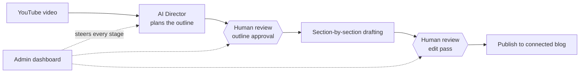

This is the one project on this page without a public repo to link to - it's a closed-source, production SaaS product I run, not an open-source demo. What follows is the design thinking and system shape behind it rather than a code walkthrough, because that's the honest version of "how it's built" for something that isn't open for anyone to read.

## Product pipeline

## What it does

- Turns a long-form YouTube video into a structured, SEO-optimised blog post - not a transcript with the timestamps stripped out.
- Plans the article's outline before writing a single sentence: which sections it needs, what order they go in, where a screenshot or generated image earns its place.
- Gives a human a review checkpoint at the outline stage and again after drafting, before anything publishes to the connected blog.
- Ships with an admin dashboard covering the whole pipeline - queued videos, in-progress drafts, and published posts in one place.

## System design

The core design decision is refusing the obvious shortcut. Most "AI blog generator" tools go straight from transcript to draft, which produces exactly what you'd expect - a wall of text that reads like a transcript with the timestamps removed, because a summarizer was never asked to *structure* anything, only to shorten it. AI Blogs inserts a planning step first: an "AI Director" stage produces the article's shape - sections, ordering, where visuals belong - and that outline is something a person reviews and adjusts before a word of the article gets drafted. Writing section-by-section against an approved outline, instead of asking a model to produce a finished piece in one pass, is where the quality difference actually comes from. It's a slower pipeline than one big prompt, and that's deliberate.

The product is built around staying out of "fully automatic" territory on purpose. Outline, then drafted sections, then a review pass - each stage is something you steer from the dashboard, not something you accept sight-unseen. The moment a tool writes and publishes without anyone looking, the failure mode stops being "not quite right" and starts being "wrong in public," and that's the trade the whole review flow exists to avoid.

## Infrastructure

Being a hosted product rather than a script run locally means the unglamorous infrastructure work has to hold up for more than one user at a time: auth, a persistent content pipeline that survives between the outline stage and the drafting stage, an admin surface, and keeping generated posts and their metadata consistent across drafts and publishes. That's most of where the actual engineering time goes - not the prompt itself, but everything around making the prompt's output trustworthy enough to publish from a dashboard instead of a terminal. The stack is a Next.js/TypeScript frontend and dashboard over a Node.js backend, with the drafting pipeline calling out to the OpenAI API at each agentic step.

## Where you can see it working

The live site, the public blog it publishes to, and the dashboard used to steer drafts are all linked above - since the code itself isn't open, those are the best way to see the actual pipeline in action rather than take a description of it on faith.
