Sharing a code snippet on social media or in a slide deck usually means an ugly plain-text screenshot. Tools like carbon.now.sh solved that by rendering code into a styled "window" and exporting it as an image - CodeSnip is a from-scratch take on the same idea, plus an animated-GIF export that doesn't use a canned animation at all: it replays your actual typing, frame by frame.

## Architecture

```mermaid
flowchart TD

subgraph group_state["Root state"]
  node_app["App.js<br/>editor + theme + GIF export state<br/>[src/App.js]"]
end

subgraph group_render["Rendering layer"]
  node_background["Background<br/>export target, resize handles<br/>[src/components/Background/index.js]"]
  node_window["Window<br/>title bar, filename, editor<br/>[src/components/Background/Window/Window.jsx]"]
  node_editor["react-simple-code-editor<br/>editable code area"]
  node_theme_css["Theme stylesheet<br/>swapped via link tag, not CSS-in-JS<br/>[public/themes/*.css]"]
end

subgraph group_gif["GIF export - 4 chained useEffects"]
  node_onrecord["onRecord&#40;&#41;<br/>builds one frame per character typed<br/>[src/App.js]"]
  node_frame_advance["Advance currentFrameToCapture<br/>useEffect 1"]
  node_frame_render["Push frame text into editorState<br/>useEffect 2"]
  node_snapshot["takeSnapshot&#40;&#41;<br/>scale 1.9x, useEffect 3<br/>[src/App.js]"]
  node_pad["Pad with 9 copies of last frame<br/>useEffect 4"]
end

subgraph group_external["External libraries"]
  node_prism{{"Prism<br/>syntax highlighting"}}
  node_dom_to_image{{"dom-to-image-more<br/>DOM to PNG capture"}}
  node_gifshot{{"gifshot<br/>client-side GIF encoder"}}
end

node_download["downloadBlob&#40;&#41;<br/>off-DOM anchor click, save-as<br/>[src/lib/downloadBlob.ts]"]

node_app -->|"renders"| node_background
node_background -->|"composes"| node_window
node_window -->|"wraps"| node_editor
node_editor -->|"highlights via"| node_prism
node_window -.->|"swaps href on theme change"| node_theme_css
node_app -->|"PNG export"| node_dom_to_image
node_dom_to_image -->|"toPng data URL"| node_download
node_app -->|"onRecord&#40;&#41; triggers"| node_onrecord
node_onrecord -->|"exportingGIF = true"| node_frame_advance
node_frame_advance -->|"next frame index"| node_frame_render
node_frame_render -->|"re-renders editor"| node_snapshot
node_snapshot -->|"captures via"| node_dom_to_image
node_dom_to_image -->|"accumulates gifFrames"| node_pad
node_pad -->|"encodes"| node_gifshot
node_gifshot -->|"animated GIF blob"| node_download

click node_app "https://github.com/manish-9245/codesnip/blob/main/src/App.js"
click node_onrecord "https://github.com/manish-9245/codesnip/blob/main/src/App.js"
click node_snapshot "https://github.com/manish-9245/codesnip/blob/main/src/App.js"
click node_background "https://github.com/manish-9245/codesnip/blob/main/src/components/Background/index.js"
click node_window "https://github.com/manish-9245/codesnip/blob/main/src/components/Background/Window/Window.jsx"
click node_download "https://github.com/manish-9245/codesnip/blob/main/src/lib/downloadBlob.ts"

classDef toneNeutral fill:#f8fafc,stroke:#334155,stroke-width:1.5px,color:#0f172a
classDef toneBlue fill:#dbeafe,stroke:#2563eb,stroke-width:1.5px,color:#172554
classDef toneAmber fill:#fef3c7,stroke:#d97706,stroke-width:1.5px,color:#78350f
classDef toneMint fill:#dcfce7,stroke:#16a34a,stroke-width:1.5px,color:#14532d
classDef toneRose fill:#ffe4e6,stroke:#e11d48,stroke-width:1.5px,color:#881337
classDef toneIndigo fill:#e0e7ff,stroke:#4f46e5,stroke-width:1.5px,color:#312e81
classDef toneTeal fill:#ccfbf1,stroke:#0f766e,stroke-width:1.5px,color:#134e4a
class node_app toneNeutral
class node_background,node_window,node_editor,node_theme_css toneBlue
class node_onrecord,node_frame_advance,node_frame_render,node_snapshot,node_pad toneAmber
class node_prism,node_dom_to_image,node_gifshot toneIndigo
class node_download toneMint
```



Boxes are clickable and jump straight to the real source file on GitHub.

## What it does

- Pick a language and a theme, paste or write a snippet, and export it as a styled PNG - the "window" chrome, gradient background, and syntax highlighting all render the way they look on screen.
- Export the same snippet as an animated GIF that replays the typing itself, rather than a generic fade-in or scroll effect.
- Runs entirely in the browser: no account, no upload, nothing about the snippet ever leaves the tab.

## System design

The GIF export is the interesting piece, and it isn't a canned animation played over finished code - it reconstructs the actual *history* of typing the snippet, one character at a time, and captures a screenshot at every step before encoding those frames into a GIF client-side. For a 200-character snippet that's 200 individual frames, each one rendered and captured before encoding even starts.

A small but deliberate finishing touch: the frame sequence is padded with several repeated copies of the final frame before encoding. Without that, the GIF would snap straight back to an empty editor the instant typing finished; the padding buys a visible pause on the completed snippet so it reads as "here's the finished code" instead of looping abruptly.

Theming is intentionally low-tech - a theme is a swappable stylesheet, not a CSS-in-JS system - which keeps adding a new theme to a matter of dropping in a new stylesheet rather than touching component code.

## Trade-offs

Because the GIF pipeline captures one DOM screenshot per character, export time scales directly with snippet length: a short snippet exports almost instantly, a long one visibly takes longer. That's the direct cost of prioritizing an authentic-looking typing replay over a pre-baked animation - a reasonable trade for a hobby export tool, less so if this needed to handle much longer snippets at speed. Syntax highlighting also currently covers more languages than the editor ships color themes for, worth knowing if theme variety is what you're evaluating it on.

## Infrastructure

A static, client-only React app with no backend and no database - it's deployable anywhere that serves static files, and there's no server in the loop for either export path.

## Running it

```bash
git clone https://github.com/manish-9245/codesnip
cd codesnip && npm install && npm start
```
