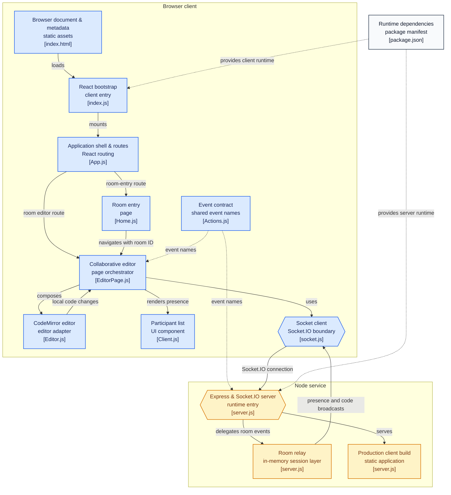

Pairing on code remotely almost always collapses into one of two bad options: screen-share, where only one person's cursor actually moves, or a live-share plugin tied to a specific editor everyone has to install. CollabCode is the smallest possible version of "a room where everyone types into the same file" - open in any browser, joined with a link, gone the moment everyone leaves.

## Architecture

Boxes are clickable and jump straight to the real source file on GitHub.

## What it does

- Create or paste in a room link, pick a username, and land in a shared CodeMirror editor - every keystroke broadcasts live to everyone else in the room.
- Presence: a running list of who's currently in the room, updated the moment someone joins or leaves.
- Nothing to install, nothing to sign up for, and no history to manage - a room is just a live document shared over a link.

## System design

CollabCode is a single shared document, not a multi-file IDE - the scope is deliberate, closer to a live scratch pad for code than a development environment. There's no persisted document on the server at all: when someone joins a room already in progress, the current content is reconstructed on the spot from whichever existing participant answers first, rather than read from a canonical copy. That's a fine trade for a quick pairing session, but it also means a room's content really does vanish the instant the last tab closes.

Client and server share one small module that defines the realtime event vocabulary once, so the two sides can't quietly drift into using different names for the same event. Feedback loops are the classic bug in a broadcast editor like this - client A types, the server relays it to client B, B's editor applies it programmatically - and CollabCode avoids re-broadcasting that applied change back out by distinguishing a real keystroke from a programmatic sync update at the editor level.

Conflict handling is intentionally simple: last-write-wins over the full document, not an operational-transform or CRDT layer. That's the right trade for a room you open for twenty minutes to debug something together with someone - not for serious concurrent multi-author editing, which would be the first thing to replace if this grew into a bigger product.

## Infrastructure

One Node process does both jobs in production: an Express server serves the built React client as static files, and the same process runs the Socket.IO realtime layer - no separate API host, no reverse proxy to configure before it works. Everything lives in memory; there's no database, so the entire infrastructure footprint is "keep one process running."

## What's next

- The editor is still on CodeMirror 5 with only JavaScript syntax highlighting wired up - other languages work as plain text without highlighting.

## Running it

Live demo linked above. `npm start` builds the React client and starts the combined Express + Socket.IO process on port 5000.
