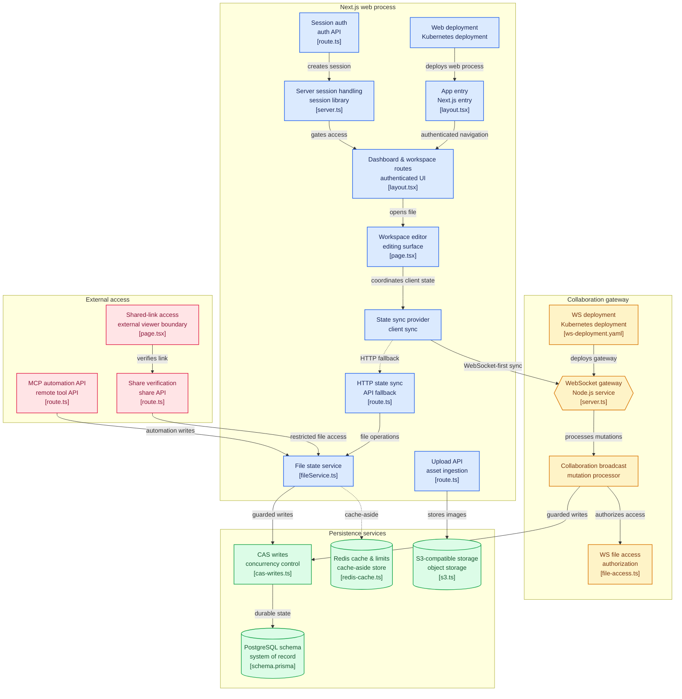

CollabPro started on third-party SaaS infrastructure - the changelog calls it out directly - and has since been migrated to a fully self-hosted stack: Postgres, Redis, S3-compatible storage, and hand-rolled session auth the team refers to internally as "Sovereign Local Authentication." It's a workspace for teams that pairs a folder tree of Markdown-style documents (Editor.js) with an infinite collaborative whiteboard (Excalidraw) per file, plus shared links, version history, and an MCP server that lets AI agents read and write the same files a human would.

## Architecture



Boxes are clickable and jump straight to the real source file on GitHub.

## A hand-built client that mimics a SaaS API it no longer uses

The most interesting architectural decision here is invisible from the outside: the frontend still calls `useQuery(api.files.getFileById, {...})` and `useMutation(api.files.updateDocument)` - the exact shape of a popular backend-as-a-service client - except there's no such service anymore. `lib/state-sync/react.tsx` implements a `Proxy`-based path builder (`makePathProxy`) that turns `api.files.updateDocument` into the string `"files:updateDocument"`, and routes it through a custom transport instead: WebSocket-first via `StateSyncWSClient`, falling back to an HTTP POST to `/api/state-sync` when the socket isn't open, with failed mutations queued in IndexedDB for replay once connectivity returns. Keeping that familiar call shape meant the entire frontend didn't need rewriting when the backend did - only the transport underneath it changed.

Polling (the fallback path when a query isn't subscribed over the socket) backs off adaptively rather than on a fixed interval: 4 seconds normally, ramping to 60 seconds after a minute of inactivity, 5 minutes once the tab is hidden, and reset instantly on any real interaction. Cheap to write, and it means an idle tab in the background isn't quietly hammering the API every few seconds.

## Compare-and-swap writes, and the bug the CAS predicate had to fix

Every write - from the WebSocket gateway, the HTTP route, and the MCP tools alike - goes through the same compare-and-swap function:

```ts
// lib/cas-writes.ts
const file = await prismaClient.file.findUnique({ where: { id: targetFileId }, select: { document: true } });
if (!file) throw new Error("File not found");
const rawCurrentDocString = file.document ?? '';
const updated = await prismaClient.file.updateMany({
  where: { id: targetFileId, document: rawCurrentDocString },
  data: { document: nextDocString },
});
if (updated.count === 1) { /* write won the race */ }
// else: someone else wrote first - reload and retry
```

The comment sitting above this in the source is worth repeating because it documents a real bug that got fixed: the CAS predicate has to compare against the *raw* stored value - an empty string for a brand-new file - not a synthesized default object. Get that wrong and every save on a newly-created file conflicts with itself forever, since the "current" value the code assumes never matches what's actually in the row.

## Real-time sync without an audit trail masquerading as one

The WebSocket gateway (`ws-server/server.ts`) is a standalone Node process, authenticated on connect via the same JWT the HTTP side issues, tracking each connection's joined rooms and subscriptions with a short-TTL access cache. For horizontal scaling it publishes to Redis pub/sub with a per-replica ID stamped on every message, so a replica recognizes and skips echoes of its own broadcasts (`isSelfOriginatedMessage`) instead of relaying a client's own edit back to itself. A RabbitMQ connection also exists in this path - `docker-compose.yml` ships a `rabbitmq` service for it - but per the code's own inline comments it only drains and acknowledges messages *after* the authoritative Postgres write has already completed. It isn't acting as a durability or audit layer today, despite looking like the kind of infrastructure that would be; the comments flag it plainly as legacy plumbing worth reconsidering rather than something load-bearing.

## The AI Co-Pilot is a mock, and it's worth saying so directly

The workspace sidebar has an "AI Co-Pilot" panel, and there's a settings page where you can paste in an OpenAI, Anthropic, Gemini, or Ollama API key. Neither is wired to a model. `AiSidebar.tsx`'s send handler keyword-matches your message and returns a canned string after a fixed delay:

```tsx
setTimeout(() => {
  let aiResponseText = "I've processed your request. Let me help you compile or expand your visual blueprints!";
  if (lowerText.includes('diagram') || lowerText.includes('analyze')) {
    aiResponseText = "📊 Workspace Whiteboard Analysis: ...";
    // ...inserts a canned shape onto the canvas
  }
}, 1800);
```

There's no `/api/ai/*` route anywhere in the codebase that would actually consume the API key the settings page collects. It's a real, working MCP server for genuine AI-agent integration (see below) sitting right next to a feature that only looks like AI - and calling that out here is more useful than letting a screenshot imply otherwise.

## An MCP server that isn't a demo

Unlike the Co-Pilot panel, `/api/mcp` is a real Streamable-HTTP MCP server built on the official `@modelcontextprotocol/sdk`, authenticated by API key, exposing four Zod-validated tools (`collabpro_list_files`, `collabpro_get_file`, `collabpro_update_document`, `collabpro_update_whiteboard`) that write through the exact same compare-and-swap functions as every other path in the app. A small stdio-to-HTTP bridge script lets local MCP clients like Claude Desktop or Cursor talk to it without duplicating any tool logic. This is the part of "AI-native collaboration" that's actually shipped, as opposed to the sidebar mock above it.

## What's still rough

Worth listing plainly, since this project is explicitly in progress: an internal architecture review (dated mid-2026, sitting in the repo under `arch-review/`) flagged serious issues in an earlier snapshot - plaintext passwords, forgeable sessions, a single oversized routing function. The current code already contradicts all three (bcrypt hashing, HMAC-signed sessions, a router split into per-domain service modules), which reads as the audit having done its job rather than being ignored - but it's a live document worth re-running rather than trusting as settled. Separately: `yjs` is still a listed dependency but only used to *read* an old, pre-CAS encoding that turned out to never have merged correctly as a real CRDT (each save built a fresh document instead of merging into the existing one) - it's kept for backward-reads only, not for new writes. And the `package.json` name field is still `erasor_clone`, a leftover from before the rename.

## Running it

```bash
git clone https://github.com/manish-9245/collabpro && cd collabpro && npm install
cp .env.example .env   # DATABASE_URL and a 32+ char SESSION_SECRET are required
docker-compose up -d postgres redis
npx prisma migrate dev   # not `db push` - the README is explicit about this
npm run dev              # http://localhost:3000
npm run ws:start         # separate terminal - the WebSocket gateway
```
