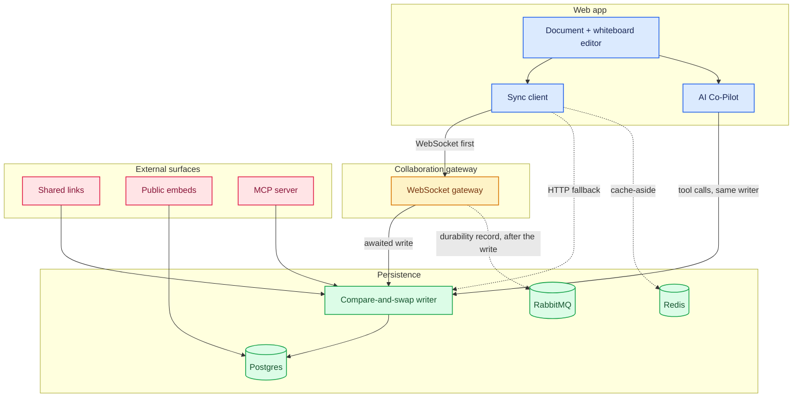
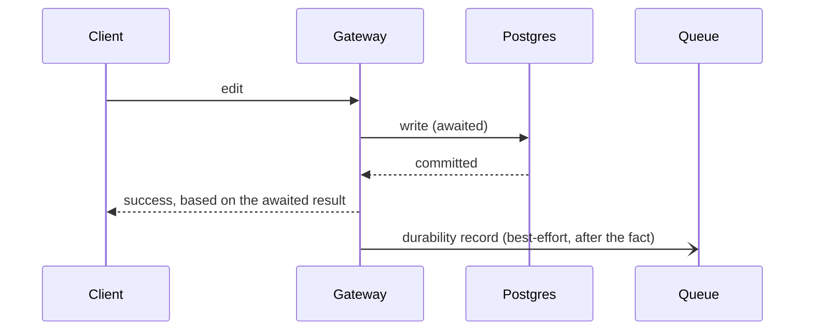
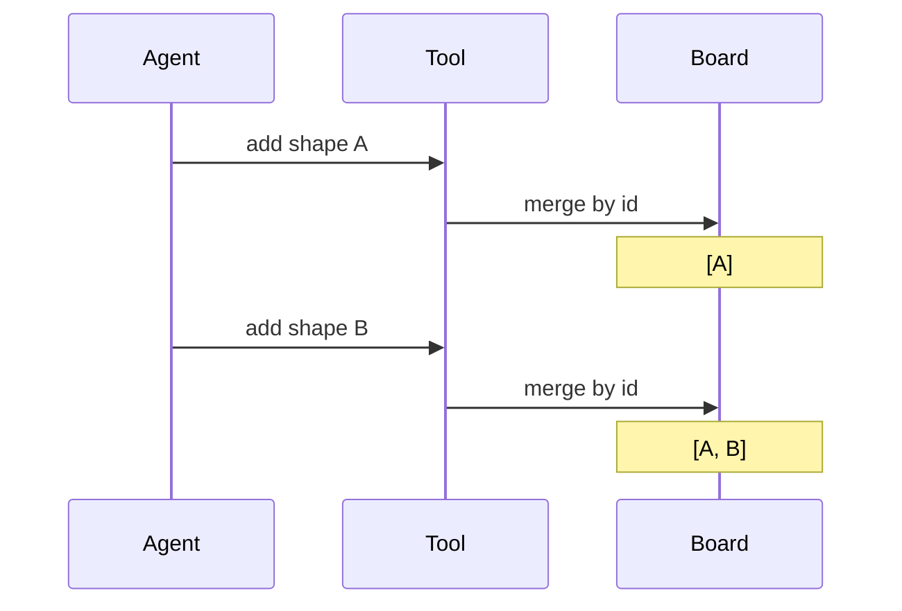

Watch an AI agent build a system diagram and it doesn't work the way a person does. A person drags one shape, then another, glancing at the whole board as it fills in. An agent calls a tool once per shape, one blind step after another, with no eyes on the canvas in between. Point CollabPro's MCP server at an agent and ask it to sketch out five boxes and it would draw all five - and then the board would show exactly one shape. Every call had quietly erased the one before it.

That bug is a good way into what CollabPro actually is: a self-hosted team workspace - a document editor and an infinite whiteboard, side by side, synced in real time - with every layer, from auth to storage to the sync transport, owned rather than rented from a platform. Own it, and every guarantee a managed backend usually gives you for free becomes something you have to build and defend yourself. This is the story of the decisions that came out of doing that.

## Shape

```mermaid
flowchart TD

subgraph web["Web app"]
  editor["Document + whiteboard editor"]
  sync_client["Sync client"]
  ai_chat["AI Co-Pilot"]
end

subgraph gateway["Collaboration gateway"]
  ws["WebSocket gateway"]
end

subgraph data["Persistence"]
  cas["Compare-and-swap writer"]
  pg[("Postgres")]
  redis[("Redis")]
  mq[("RabbitMQ")]
end

subgraph external["External surfaces"]
  share["Shared links"]
  embed["Public embeds"]
  mcp["MCP server"]
end

editor --> sync_client
editor --> ai_chat
sync_client -->|"WebSocket first"| ws
sync_client -.->|"HTTP fallback"| cas
ai_chat -->|"tool calls, same writer"| cas
ws -->|"awaited write"| cas
ws -.->|"durability record, after the write"| mq
cas --> pg
sync_client -.->|"cache-aside"| redis
share --> cas
embed --> pg
mcp --> cas

classDef toneBlue fill:#dbeafe,stroke:#2563eb,stroke-width:1.5px,color:#172554
classDef toneAmber fill:#fef3c7,stroke:#d97706,stroke-width:1.5px,color:#78350f
classDef toneMint fill:#dcfce7,stroke:#16a34a,stroke-width:1.5px,color:#14532d
classDef toneRose fill:#ffe4e6,stroke:#e11d48,stroke-width:1.5px,color:#881337
class editor,sync_client,ai_chat toneBlue
class ws toneAmber
class cas,pg,redis,mq toneMint
class share,embed,mcp toneRose
```

## One writer, no matter who's writing

I wanted a human editing a document, a peer's edit arriving over the WebSocket, and an AI Co-Pilot executing a tool call to all be the same event from the database's point of view - no special-cased "AI write path" with looser rules, no peer-broadcast path that skips a check the human path enforces. So every one of them funnels through a single compare-and-swap function: read the current value, attempt an update conditioned on the row still matching what was just read, and if nothing matched, someone else won the race - reload and retry instead of overwriting them.

The part that has to be exact is what "current value" means. For a brand-new file, it's an empty string - not a default object synthesized for the editor's convenience. Get that wrong and a save on a new file loses a race against itself forever, because the value the check assumes it's comparing against never actually matches what's in the row. Optimistic concurrency is only as trustworthy as the read it's conditioned on.

Funneling every writer through this one function is also why an AI-driven edit doesn't get a shortcut: it races a human edit the same way two humans would race each other, on the same terms, decided by the same rule.

## What the client thinks it's talking to

The frontend calls things shaped like `useQuery(api.files.getFileById, {...})` - a stable, backend-agnostic surface that doesn't care which transport is underneath it. A `Proxy` turns each call into a plain routable string, then a real transport picks it up: WebSocket first, HTTP if the socket isn't open, and anything that fails while offline gets queued locally and replayed once the connection's back. The editor components never have to know which path actually served a given call.

Polling, the fallback path, backs off rather than running on a fixed clock - fast while a tab's active, sparse once it's idle or hidden, snapping back to full speed the instant something changes locally. An idle tab in a background window has no reason to be checking in every few seconds just because its socket happened to be closed.

## Write first, then record it

The order between the database write and the durability record matters more than either step does alone. The WebSocket gateway always awaits the write to Postgres and reports success or failure from that awaited result - never from anything upstream of it. Only once the write is confirmed does a best-effort record go out to RabbitMQ, marking that it happened.

```mermaid
sequenceDiagram
    participant Client
    participant Gateway
    participant Postgres
    participant Queue

    Client->>Gateway: edit
    Gateway->>Postgres: write (awaited)
    Postgres-->>Gateway: committed
    Gateway-->>Client: success, based on the awaited result
    Gateway-)Queue: durability record (best-effort, after the fact)
```

Get that ordering backwards and you get a database's version of a phantom charge: a client told "saved" before the save actually happened, with nothing left standing if it then fails. Ordering it correctly means a queue failure can never retroactively undo a write that already succeeded, and it can never get reported to the client as a save failure either - the two outcomes are fully decoupled.

What that record doesn't do yet is anything useful downstream. It's drained off the queue, acknowledged, logged - and nothing persists it or replays it. The ordering guarantee is real and load-bearing today. The audit trail I'd eventually want sitting on top of it isn't built yet, and it's more honest to say that outright than to let "durability record" imply more than it currently does.

## A Co-Pilot with more than one voice

The AI Co-Pilot talks to four providers - OpenAI, Anthropic, Gemini, NVIDIA NIM - and they don't all speak the same language. Three of them expose an OpenAI-compatible surface, so one client handles all three without knowing the difference. Anthropic's Messages API is different enough, down to how it streams a tool call back token by token, that squeezing it through a compatibility shim would have meant chasing edge cases forever. It got its own request and response handling instead. Wiring in a fourth provider "for real" meant accepting that one of the four needed genuinely separate code - not a config flag pointing at a different base URL and hoping for the best.

## Designing for a caller that iterates, not one that asks once

Back to the vanishing diagram. The whiteboard tool originally took an array of elements and treated it as the entire board - correct for the human editor, which really does autosave its complete canvas state on every change. It's the wrong assumption for an agent, which builds a diagram the only way it can: one tool call per shape, in sequence, with no view of the board in between calls. Each call was overwriting the last one, and a five-step build ended with a board holding exactly whatever the final call happened to include.

```mermaid
sequenceDiagram
    participant Agent
    participant Tool
    participant Board

    Agent->>Tool: add shape A
    Tool->>Board: merge by id
    Note over Board: [A]
    Agent->>Tool: add shape B
    Tool->>Board: merge by id
    Note over Board: [A, B]
```

The fix was to match incoming elements onto the existing board by id and merge them in, rather than replace the board outright - a full replace still exists, but it's an explicit opt-in now, reserved for the one case that actually wants it, instead of the default every other call was silently paying for.

The same lesson showed up twice more once I started designing specifically for a caller that iterates instead of one that asks once. A single icon on the board is a cluster of grouped primitives, not one shape - handing that whole cluster back meant an agent placing a dozen icons had to carry hundreds of raw shape objects through its own context and retype them faithfully into the next call, exactly the kind of long mechanical output most likely to drop a token somewhere in the middle. Returning a short-lived reference instead - something the agent hands back rather than repeats - turned a multi-icon diagram from a context-heavy chore into a cheap one. And rather than trust every call to have read the written guidance on color and spacing conventions, the tool itself now rejects what would look objectively broken on any diagram - an arrow with no real geometry, text with no visible color, shapes overlapping without being grouped - since a model can skim past a sentence in a prompt in a way it can't skim past a rejected tool call. Anything that's genuinely a matter of taste stays advisory rather than enforced; the enforcement is only for the things nobody would ever want anyway.

## Still open

The durability record is ordered correctly, but nothing on the consuming end persists or replays it yet - that's real unfinished work, not a design choice I'm defending. An older CRDT-based document encoding is still readable for backward compatibility, but nothing writes it anymore, since it never actually merged correctly as a CRDT to begin with - each save built a fresh document instead of merging into the one before it. Neither is a live correctness problem today. Both are the kind of thing that's easy to leave as a permanent asterisk, and I'd rather go back and finish them properly than let that happen.
