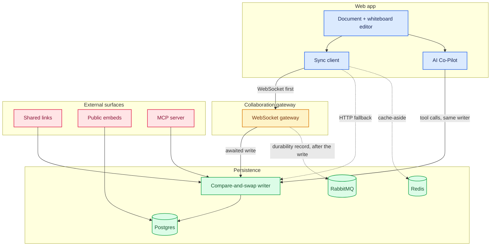
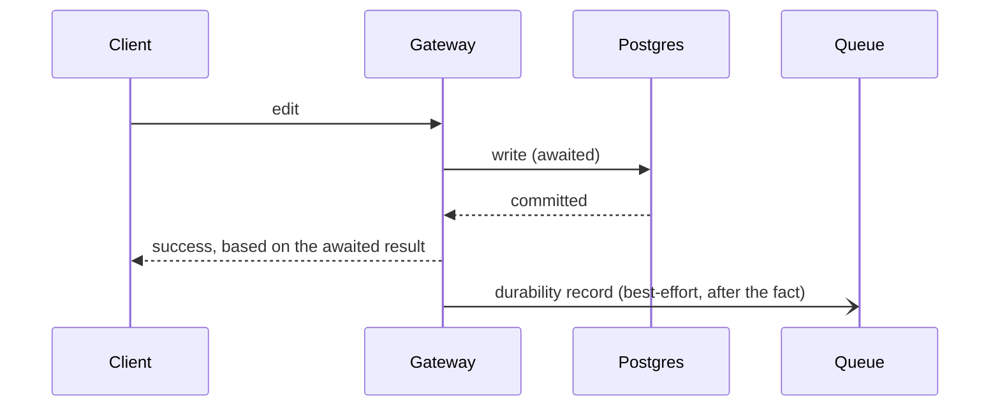
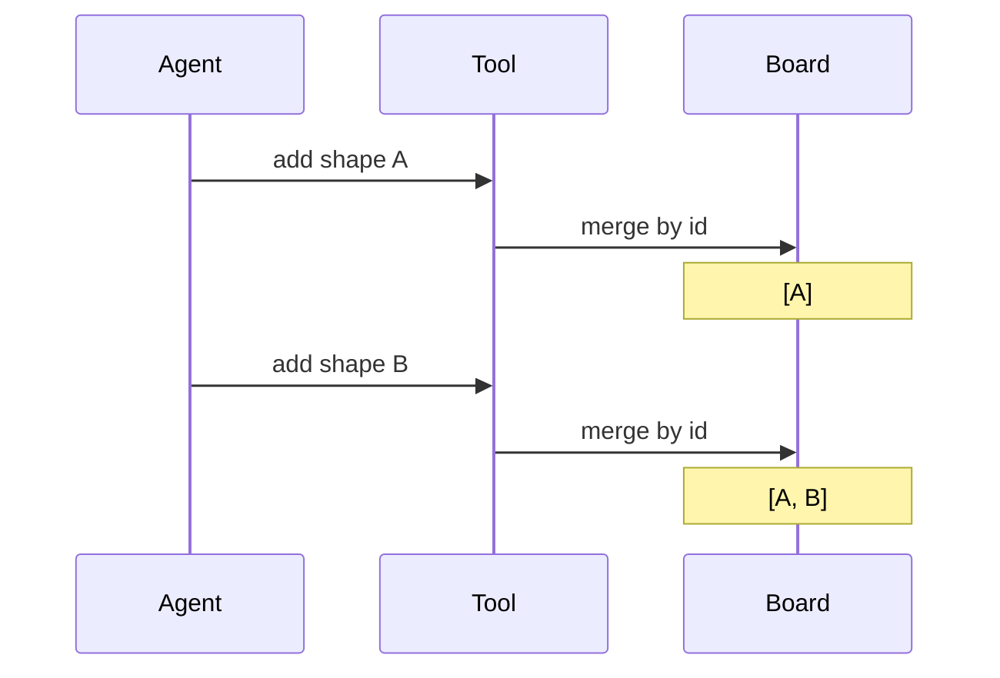

CollabPro is a team workspace: a folder tree of documents, each with a block editor on one side and an infinite whiteboard on the other, synced in real time across everyone looking at it. Every layer - auth, storage, the sync transport, the database - is self-hosted, no managed backend underneath it. That's the constraint the rest of this is about: what it takes to own consistency, durability, and correctness yourself instead of delegating them to someone else's platform.

## Shape

```mermaid
flowchart TD

subgraph web["Web app"]
  editor["Document + whiteboard editor"]
  sync_client["Sync client"]
  ai_chat["AI Co-Pilot"]
end

subgraph gateway["Collaboration gateway"]
  ws["WebSocket gateway"]
end

subgraph data["Persistence"]
  cas["Compare-and-swap writer"]
  pg[("Postgres")]
  redis[("Redis")]
  mq[("RabbitMQ")]
end

subgraph external["External surfaces"]
  share["Shared links"]
  embed["Public embeds"]
  mcp["MCP server"]
end

editor --> sync_client
editor --> ai_chat
sync_client -->|"WebSocket first"| ws
sync_client -.->|"HTTP fallback"| cas
ai_chat -->|"tool calls, same writer"| cas
ws -->|"awaited write"| cas
ws -.->|"durability record, after the write"| mq
cas --> pg
sync_client -.->|"cache-aside"| redis
share --> cas
embed --> pg
mcp --> cas

classDef toneBlue fill:#dbeafe,stroke:#2563eb,stroke-width:1.5px,color:#172554
classDef toneAmber fill:#fef3c7,stroke:#d97706,stroke-width:1.5px,color:#78350f
classDef toneMint fill:#dcfce7,stroke:#16a34a,stroke-width:1.5px,color:#14532d
classDef toneRose fill:#ffe4e6,stroke:#e11d48,stroke-width:1.5px,color:#881337
class editor,sync_client,ai_chat toneBlue
class ws toneAmber
class cas,pg,redis,mq toneMint
class share,embed,mcp toneRose
```

## One writer, no matter who's writing

A human typing, the WebSocket gateway relaying a peer's edit, and the AI Co-Pilot executing a tool call all go through the same compare-and-swap function. Read the current value, attempt an update conditioned on the row still matching what was just read, and if nothing matched, someone else won the race - reload and retry instead of overwriting them.

The predicate is the part that has to be exact. For a brand-new file, "current value" is an empty string, not a default object synthesized for the editor's benefit. Compare against anything other than the raw stored value and a save can lose a race against itself forever, because the "current" state the check assumes never actually matches the row. Optimistic concurrency is only as correct as what it's conditioned on.

Routing every writer - human, peer broadcast, AI - through this one function is also the reason an AI-driven edit isn't a special case. It races against a human edit exactly the way two humans would, wins or loses by the same rule, and never gets a shortcut around the check just because a model made the call instead of a person.

## What the client thinks it's talking to

The frontend calls things shaped like `useQuery(api.files.getFileById, {...})` - a stable, backend-agnostic call surface. A `Proxy` turns that into a plain routable string underneath, and a real transport handles it from there: WebSocket when one's open, HTTP when it isn't, anything that fails offline queued locally and replayed once connectivity's back. The frontend never has to know which path served a given call.

Polling, the fallback path, backs off rather than running on a fixed interval - fast while the tab's active, sparse once it's idle or hidden, and it snaps back to full speed the instant something changes locally. An idle background tab has no reason to be checking in every few seconds.

Every guarded query in the client passes a `'skip'` sentinel to say "don't run yet" - and the check on the other end has to agree on exactly where that sentinel lives in the call, or a "guarded" query fires anyway, just with a payload that means nothing. It's a small, easy-to-get-wrong convention, and the server's job is to reject a nonsense payload cleanly rather than assume the client always gets the convention right.

## Write first, then record it

The ordering between the database write and the durability record matters more than either step alone. The WebSocket gateway always awaits the direct write to Postgres before telling the client anything - success or failure is reported from that awaited result, never assumed. Only after the write is confirmed does a best-effort record go to RabbitMQ, marking that it happened.

```mermaid
sequenceDiagram
    participant Client
    participant Gateway
    participant Postgres
    participant Queue

    Client->>Gateway: edit
    Gateway->>Postgres: write (awaited)
    Postgres-->>Gateway: committed
    Gateway-->>Client: success, based on the awaited result
    Gateway-)Queue: durability record (best-effort, after the fact)
```

That ordering means a failure to enqueue the record can never retroactively make a successful write look like it didn't happen, and a queue failure never gets reported to the client as a save failure either - the two are decoupled on purpose. What the record doesn't yet do is anything on the consuming end: it's drained, acknowledged, and logged, not persisted or replayed anywhere. The ordering guarantee is real; the audit trail on top of it isn't finished, and it's more useful to say that plainly than to imply otherwise.

## A Co-Pilot with more than one voice

The AI Co-Pilot supports four providers - OpenAI, Anthropic, Gemini, NVIDIA NIM - and they don't all speak the same protocol. Three of them expose an OpenAI-compatible surface, so one client handles all three interchangeably. Anthropic's Messages API is different enough - including how it streams a tool call back token by token - that it gets its own request and response handling rather than being forced through a compatibility shim that would leak edge cases. Supporting a fourth provider "for real" meant accepting that one of them needed genuinely separate code, not a config flag pointing at a slightly different base URL.

## Designing tools for a caller that iterates, not a caller that asks once

The MCP server gives an AI agent the same read/write access to files a person has: list, read, create, update a document, update a whiteboard, search and place icons from community libraries. Eight tools, all funneled through the same compare-and-swap writer everything else uses. What actually shapes this surface is a fact about how an agent uses a tool: it calls the same tool many times across one task, once per step, not once with everything decided up front. Three decisions follow directly from that.

**Merge by default, replace as an opt-in.** A diagram gets built one shape at a time - an agent adds a box, then an arrow, then another box, each as its own tool call. If a whiteboard write treats its input as the entire board, every call after the first one erases what came before it. The tool matches incoming elements onto the existing board by id and merges them in; a full-board replace is still available, but only behind an explicit flag, because it's the exception, not what most calls actually want.

```mermaid
sequenceDiagram
    participant Agent
    participant Tool
    participant Board

    Agent->>Tool: add shape A
    Tool->>Board: merge by id
    Note over Board: [A]
    Agent->>Tool: add shape B
    Tool->>Board: merge by id
    Note over Board: [A, B]
```

**Hand back a reference, not the geometry.** A single icon on the board is a small cluster of grouped primitives, not one shape. Returning that whole cluster means an agent placing a dozen icons has to carry hundreds of raw shape objects through its own context and retype them faithfully into the next call - exactly the kind of long, mechanical output most likely to drop a token, and exactly the kind of context cost that compounds across a real session. A short-lived reference the agent hands back instead of repeating keeps a multi-icon diagram cheap to build.

**Enforce what's objectively wrong, leave taste as guidance.** Color conventions and spacing live in written guidance the agent can read - but a model can skim past a sentence in a prompt in a way it can't skim past a rejected tool call. So the tool itself rejects an arrow with no real geometry, text with no visible color, shapes that overlap without being grouped - things that would look broken on any diagram, not just this one. Anything that's actually a matter of taste stays advisory rather than enforced, on purpose: baking taste into a hard rule just trades one kind of rigidity for another.

## Still open

The durability record is correctly ordered, but nothing on the consuming side persists or replays it yet - that's real unfinished work, not a design choice. An older CRDT-based document encoding is still readable for backward compatibility, but nothing writes it anymore, since it never actually merged correctly as a CRDT in the first place - each save built a fresh document rather than merging into the one before it. Neither is a live correctness problem today; both deserve a real answer rather than staying a permanent asterisk.
