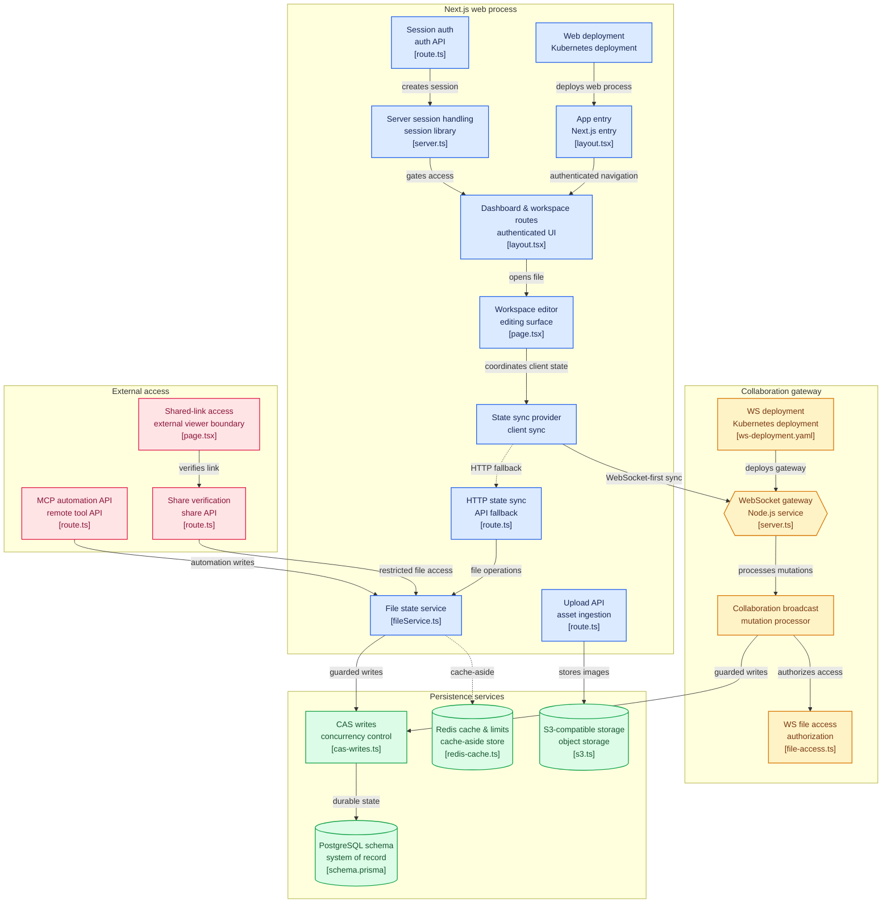

CollabPro started on third-party SaaS infrastructure and has since been migrated to a fully self-hosted stack - Postgres, Redis, S3-compatible storage, and its own session auth. It's a workspace for teams that pairs a folder tree of documents (a block-based Editor.js surface) with an infinite collaborative whiteboard (Excalidraw) per file, plus shared links, version history, and an MCP server that lets AI agents read and write the same files a human would.

## Architecture


```mermaid
flowchart TD

subgraph group_web["Next.js web process"]
  node_entry["App entry<br/>Next.js entry<br/>[layout.tsx]"]
  node_dashboard["Dashboard &amp; workspace routes<br/>authenticated UI<br/>[layout.tsx]"]
  node_workspace["Workspace editor<br/>editing surface<br/>[page.tsx]"]
  node_state_provider["State sync provider<br/>client sync"]
  node_http_sync["HTTP state sync<br/>API fallback<br/>[route.ts]"]
  node_file_ops["File state service<br/>[fileService.ts]"]
  node_auth["Session auth<br/>auth API<br/>[route.ts]"]
  node_session["Server session handling<br/>session library<br/>[server.ts]"]
  node_uploads["Upload API<br/>asset ingestion<br/>[route.ts]"]
  node_web_deploy["Web deployment<br/>Kubernetes deployment"]
end

subgraph group_collab["Collaboration gateway"]
  node_ws_server{{"WebSocket gateway<br/>Node.js service<br/>[server.ts]"}}
  node_ws_broadcast["Collaboration broadcast<br/>mutation processor"]
  node_ws_access["WS file access<br/>authorization<br/>[file-access.ts]"]
  node_ws_deploy["WS deployment<br/>Kubernetes deployment<br/>[ws-deployment.yaml]"]
end

subgraph group_data["Persistence services"]
  node_cas["CAS writes<br/>concurrency control<br/>[cas-writes.ts]"]
  node_prisma[("PostgreSQL schema<br/>system of record<br/>[schema.prisma]")]
  node_redis[("Redis cache &amp; limits<br/>cache-aside store<br/>[redis-cache.ts]")]
  node_s3[("S3-compatible storage<br/>object storage<br/>[s3.ts]")]
end

subgraph group_external["External access"]
  node_share["Shared-link access<br/>external viewer boundary<br/>[page.tsx]"]
  node_share_verify["Share verification<br/>share API<br/>[route.ts]"]
  node_mcp["MCP automation API<br/>remote tool API<br/>[route.ts]"]
end

node_entry -->|"authenticated navigation"| node_dashboard
node_dashboard -->|"opens file"| node_workspace
node_workspace -->|"coordinates client state"| node_state_provider
node_state_provider -->|"WebSocket-first sync"| node_ws_server
node_state_provider -.->|"HTTP fallback"| node_http_sync
node_http_sync -->|"file operations"| node_file_ops
node_file_ops -->|"guarded writes"| node_cas
node_ws_server -->|"processes mutations"| node_ws_broadcast
node_ws_broadcast -->|"authorizes access"| node_ws_access
node_ws_broadcast -->|"guarded writes"| node_cas
node_cas -->|"durable state"| node_prisma
node_file_ops -.->|"cache-aside"| node_redis
node_auth -->|"creates session"| node_session
node_session -->|"gates access"| node_dashboard
node_share -->|"verifies link"| node_share_verify
node_share_verify -->|"restricted file access"| node_file_ops
node_mcp -->|"automation writes"| node_file_ops
node_uploads -->|"stores images"| node_s3
node_web_deploy -->|"deploys web process"| node_entry
node_ws_deploy -->|"deploys gateway"| node_ws_server

click node_entry "https://github.com/manish-9245/collabpro/blob/main/app/layout.tsx"
click node_dashboard "https://github.com/manish-9245/collabpro/blob/main/app/(routes)/dashboard/layout.tsx"
click node_workspace "https://github.com/manish-9245/collabpro/blob/main/app/(routes)/workspace/%5BfileId%5D/page.tsx"
click node_state_provider "https://github.com/manish-9245/collabpro/blob/main/app/StateSyncProvider.tsx"
click node_http_sync "https://github.com/manish-9245/collabpro/blob/main/app/api/state-sync/route.ts"
click node_file_ops "https://github.com/manish-9245/collabpro/blob/main/app/api/state-sync/services/fileService.ts"
click node_auth "https://github.com/manish-9245/collabpro/blob/main/app/api/auth/login/route.ts"
click node_session "https://github.com/manish-9245/collabpro/blob/main/lib/session-auth/server.ts"
click node_share "https://github.com/manish-9245/collabpro/blob/main/app/(routes)/workspace/share/%5BsharedLinkId%5D/page.tsx"
click node_share_verify "https://github.com/manish-9245/collabpro/blob/main/app/api/share/verify/route.ts"
click node_mcp "https://github.com/manish-9245/collabpro/blob/main/app/api/mcp/route.ts"
click node_ws_server "https://github.com/manish-9245/collabpro/blob/main/ws-server/server.ts"
click node_ws_broadcast "https://github.com/manish-9245/collabpro/blob/main/ws-server/collab-broadcast.ts"
click node_ws_access "https://github.com/manish-9245/collabpro/blob/main/ws-server/file-access.ts"
click node_cas "https://github.com/manish-9245/collabpro/blob/main/lib/cas-writes.ts"
click node_prisma "https://github.com/manish-9245/collabpro/blob/main/prisma/schema.prisma"
click node_redis "https://github.com/manish-9245/collabpro/blob/main/lib/redis-cache.ts"
click node_uploads "https://github.com/manish-9245/collabpro/blob/main/app/api/upload/route.ts"
click node_s3 "https://github.com/manish-9245/collabpro/blob/main/lib/s3.ts"
click node_web_deploy "https://github.com/manish-9245/collabpro/blob/main/charts/collabpro/templates/web-deployment.yaml"
click node_ws_deploy "https://github.com/manish-9245/collabpro/blob/main/charts/collabpro/templates/ws-deployment.yaml"

classDef toneNeutral fill:#f8fafc,stroke:#334155,stroke-width:1.5px,color:#0f172a
classDef toneBlue fill:#dbeafe,stroke:#2563eb,stroke-width:1.5px,color:#172554
classDef toneAmber fill:#fef3c7,stroke:#d97706,stroke-width:1.5px,color:#78350f
classDef toneMint fill:#dcfce7,stroke:#16a34a,stroke-width:1.5px,color:#14532d
classDef toneRose fill:#ffe4e6,stroke:#e11d48,stroke-width:1.5px,color:#881337
classDef toneIndigo fill:#e0e7ff,stroke:#4f46e5,stroke-width:1.5px,color:#312e81
classDef toneTeal fill:#ccfbf1,stroke:#0f766e,stroke-width:1.5px,color:#134e4a
class node_entry,node_dashboard,node_workspace,node_state_provider,node_http_sync,node_file_ops,node_auth,node_session,node_uploads,node_web_deploy toneBlue
class node_ws_server,node_ws_broadcast,node_ws_access,node_ws_deploy toneAmber
class node_cas,node_prisma,node_redis,node_s3 toneMint
class node_share,node_share_verify,node_mcp toneRose
```

Boxes are clickable and jump straight to the real source file on GitHub.

## What it does

- **A folder tree of team documents**, each pairing a block-based editor with its own infinite whiteboard - notes and diagrams live side by side instead of in separate tools.
- **Real-time multiplayer editing**: everyone with a file open sees everyone else's changes as they happen, with version history to fall back on.
- **Shareable links** that expose a single file to people outside the team, without giving them the workspace.
- **An MCP server** that lets AI agents (Claude Desktop, Cursor, or anything else that speaks MCP) list, read, and write the same files a teammate would, through the same authorized path.

## System design

Every client prefers a **live WebSocket connection** for sync and falls back to HTTP polling only when the socket isn't available, with mutations queued locally and replayed automatically once connectivity returns - so a flaky connection degrades gracefully instead of losing edits. The WebSocket gateway is a separate, horizontally scalable service: it fans broadcasts out through **Redis pub/sub across replicas**, tagging each message with its origin replica so a server never echoes a client's own edit back to it.

Underneath both paths, every write - from the browser, the WebSocket gateway, or an MCP tool call - goes through the same **compare-and-swap function against Postgres**. That's the concurrency model in one sentence: a write only lands if the row hasn't changed since it was read, so two people editing the same file at once fail safe and retry instead of silently clobbering each other.

The **MCP integration is a real, authenticated tool server** (list files, read a file, update a document, update a whiteboard), not a demo - it writes through the exact same compare-and-swap path as the UI, so an AI agent and a human editing the same file are subject to the same conflict protection. A separate in-app "AI Co-Pilot" panel exists in the sidebar but isn't wired to a model yet; that's a real gap, called out here rather than left implicit.

## Infrastructure

CollabPro is **fully self-hosted** after an earlier migration off third-party SaaS: **Postgres** is the system of record, **Redis** handles caching and pub/sub fan-out for the realtime layer, and file uploads land in **S3-compatible object storage**. The web app and the WebSocket gateway are packaged as separate containers with their own **Kubernetes deployment**, so the realtime layer can scale independently of the request-serving app. Auth is self-issued rather than delegated to a third-party provider - **bcrypt-hashed credentials and HMAC-signed sessions**, hardened after an internal architecture review flagged weaker versions of both in an earlier snapshot.

## What's next

- Wiring the AI Co-Pilot panel to a real model - the settings page already collects API keys for it.
- Retiring a legacy message-queue service left over from a pre-compare-and-swap design; it's no longer load-bearing.

## Running it

```bash
git clone https://github.com/manish-9245/collabpro && cd collabpro && npm install
cp .env.example .env   # DATABASE_URL and a 32+ char SESSION_SECRET are required
docker-compose up -d postgres redis
npx prisma migrate dev
npm run dev              # http://localhost:3000
npm run ws:start         # separate terminal - the WebSocket gateway
```
