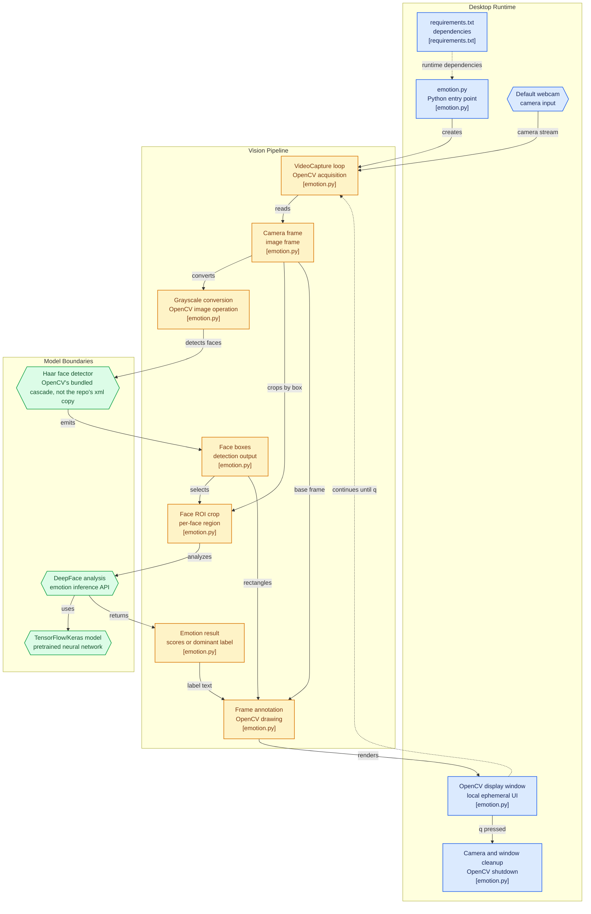

Most "emotion recognition" repos are really two projects stapled together: a face detector, and a classifier that only works on a perfectly cropped face. The interesting engineering question isn't "can a model tell happy from sad" - that part is a solved, importable problem - it's how little code it takes to wire the detector and the classifier together into something that runs live off a webcam.

## Architecture



Boxes are clickable and jump straight to the real source file on GitHub.

## What it does

Points at a live webcam feed, finds every face in the frame, and draws a bounding box with a predicted emotion label on each one - updated continuously as the video plays, with no setup step and nothing to train.

## System design

Two models split two different jobs instead of one model doing both: a fast classical face detector finds *where* faces are in each frame, and a deep learning model classifies *what expression* each one is making. That split - cheap localization, expensive classification - is what makes it possible to run live on a laptop webcam at all.

The detector's output is trusted rather than re-verified. The emotion model would normally run its own, heavier face-detection pass before classifying anything; skipping that redundant second detection is what keeps the pipeline fast, at a real accuracy cost - the classical detector doing the trusted first pass is noticeably less robust to side angles, partial occlusion, and uneven lighting than the deep model's own detector would be on its own. That's the actual design trade behind "the shortest code path": pay for face detection once, not twice, and accept that the cheaper detector occasionally misses a face the more expensive one wouldn't have.

## Trade-offs

Emotion inference runs synchronously, once per detected face, inside the main video loop. With one person on camera that's comfortable; with three or four people in frame, the loop has to run inference that many times before it can draw the next frame, with no batching or background threading to soften it. That's an acceptable ceiling for a demo script - the fix, if it needed to hold a steady frame rate with a crowd in view, would be batching all detected faces into a single inference call or moving inference to a background thread.

## Infrastructure

A single Python script with no training step and no dataset to download - both models are pretrained and pulled in via pip - running entirely on-device against the default webcam, with no backend and no cloud dependency.

## Running it

```bash
pip install -r requirements.txt
python emotion.py   # press q to quit
```
