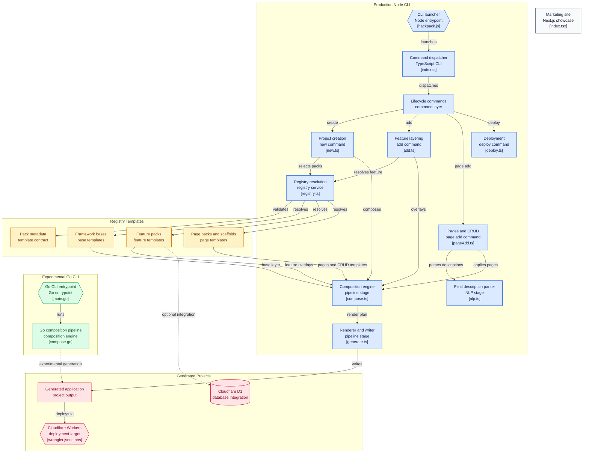

Most "AI app generators" scaffold a project by asking a model to write it from scratch, which means every generated app is a little different and a little wrong in its own way. Hackpack takes the opposite bet: `npx create-hackpack new my-app --base=ts-nextjs --features=auth-better-auth,db-d1-drizzle` produces a working app in about 90 seconds by *composing* hand-written templates - a base framework, a stack of optional features, and prebuilt page variants - never by generating code with an LLM. The generation step is 100% deterministic file operations and Handlebars rendering, which is also why it's fast enough to demo live.

## Architecture



Boxes are clickable and jump straight to the real source file on GitHub.

## Composing a project without a model in the loop

The entry point (`cli/src/commands/new.ts`) collects a base, a list of features, and a list of pages - either interactively via `@clack/prompts` or straight from flags - and hands them to `compose()` in `cli/src/compose.ts`. That function layers three things onto the target directory in order: a `_common/` hygiene layer (gitignore, editor config), the chosen base's template directory, and then each feature in turn. Every feature copies its own `templates/features/<name>/files/`, optionally overlays a `files-<base>/` variant for that specific framework, merges its `package.json` or `pyproject.toml` dependencies into the project's manifest, and appends any environment variables it needs.

The part that keeps this from turning into a pile of merge conflicts is anchor-based wiring instead of AST manipulation:

```ts
// cli/src/compose.ts
for (const w of manifest.wiring ?? []) {
  await insertAtAnchor(path.join(targetDir, w.file), w.anchor, w.insert);
}
```

Each feature declares the exact comment anchor it needs to splice into - `// hackpack:dashboard-nav`, say - and `insertAtAnchor` finds that line in the already-copied base file and inserts the feature's snippet right after it. No parsing, no codemod, just a known marker and a known insertion point. It's a simpler mechanism than a real code-generation tool would use, and that simplicity is exactly why it's reliable enough to run unattended in CI.

## Pages that know what's actually installed

The generated pages aren't static copies either. A login page needs to render real `authClient.signIn.email()` calls if `auth-better-auth` was installed, or a "no auth provider configured" placeholder if it wasn't - and `compose()` picks between those by checking `installedCategories` and selecting the matching `variants/<category>` subfolder (`variants/auth-better-auth` vs. `variants/none`) before copying. It's a small mechanism, but it's the difference between a scaffolded page that actually works and one that silently references a client that was never installed.

## Turning a sentence into a database schema

`hackpack page add orders --describe "a list of orders with title, price, and user, behind login"` skips the interactive prompts entirely. `cli/src/nlp.ts` runs the description through `compromise` (a local NLP library) and a set of hand-written regexes - `parseEntity()` for the resource name, `parseFields()` for the field list, `parseAuth()` for the `--auth=protected` equivalent - and if confidence comes back low (no entity found, zero fields parsed), it falls back to the interactive wizard rather than guessing wrong silently. Worth saying plainly: `compromise`'s actual parse tree isn't used yet - the file computes it and then discards it (`void doc; // reserved for future noun-phrase disambiguation`), so today's "NLP" parsing is entirely regex-driven, with the NLP library sitting in as a dependency for planned work rather than doing the job itself right now.

Once fields are known, `cli/src/generate.ts` maps each one to the right type for whatever stack is installed:

```ts
// cli/src/generate.ts
function drizzleColumn(name: string, type: FieldType): string {
  switch (type) {
    case "number": return `${name}: real("${name}")`;
    case "boolean": return `${name}: integer("${name}", { mode: "boolean" })`;
    case "date": return `${name}: integer("${name}", { mode: "timestamp" })`;
    default: return `${name}: text("${name}")`;
  }
}
```

The same field list drives a TypeScript/Zod type, a Drizzle column, or a Python/SQL type depending on which base and DB feature are installed, then the resulting schema, API route, and list/detail pages get written and spliced in through the same anchor mechanism as `compose()`.

## The only test is an end-to-end one

`cli/test/self-check.ts` - run in CI as `npm run selfcheck` - doesn't unit-test individual functions. It actually calls `compose()` for a `ts-nextjs` project and a `py-fastapi` project into temp directories, then asserts on the real generated output: dependency merges landed, the Cloudflare D1 binding shows up in `wrangler.jsonc`, the login page renders the better-auth variant, the generated CRUD schema and routes exist. One test, but it's a genuine integration test covering the compose-and-generate pipeline across two languages, which catches the failure mode that actually matters here - "did the generated project come out broken" - more directly than a pile of unit tests would.

## What's still rough

This is very much a working-on-it project, and it's more honest to say so than to paper over it. The Go CLI in `go-cli/` is explicitly marked experimental in the README and doesn't support the `--describe` flag at all - only explicit `--fields`. The `ts-vite-react` base is flagged in the README's own compatibility matrix as a stub for auth, since a frontend-only base has nowhere server-side to wire real authentication into. And the repo is really three loosely-connected projects sharing one Git history - the TypeScript CLI, the Go rewrite, and a separate Next.js marketing site in `landing/` - each with its own package manager and no unifying root build.

## Running it

```bash
npx create-hackpack@latest new my-app \
  --base=ts-nextjs \
  --features=ui-shadcn,auth-better-auth,db-d1-drizzle \
  --pages=landing,login,signup,dashboard
cd my-app && npm install && npm run dev
```

Adding a page later: `hackpack page add orders --fields=title:string,price:number,userId:relation --auth=protected`, or the natural-language form shown above. `npm run cf:deploy` ships the generated app to Cloudflare Workers.
