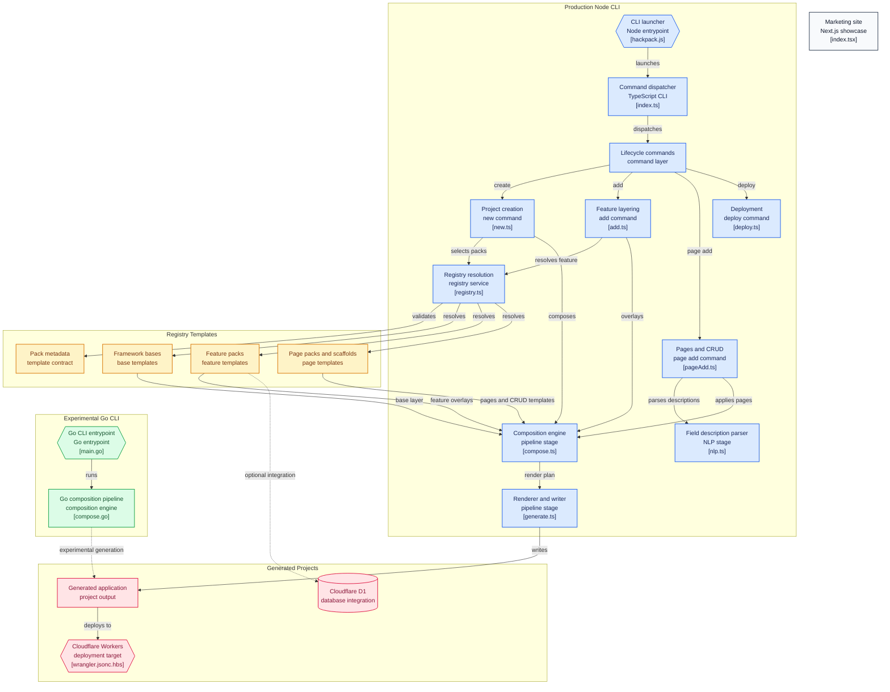

Most "AI app generators" scaffold a project by asking a model to write it from scratch, which means every generated app is a little different and a little wrong in its own way. Hackpack takes the opposite bet: `npx create-hackpack new my-app --base=ts-nextjs --features=auth-better-auth,db-d1-drizzle` produces a working app in about 90 seconds by *composing* hand-written templates - a base framework, a stack of optional features, and prebuilt page variants - never by generating code with an LLM. The generation step is 100% deterministic file operations, which is also why it's fast enough to demo live.

## Architecture


```mermaid
flowchart TD

subgraph group_node_cli["Production Node CLI"]
  node_node_entry{{"CLI launcher<br/>Node entrypoint<br/>[hackpack.js]"}}
  node_node_dispatch["Command dispatcher<br/>TypeScript CLI<br/>[index.ts]"]
  node_commands["Lifecycle commands<br/>command layer"]
  node_new_command["Project creation<br/>new command<br/>[new.ts]"]
  node_add_command["Feature layering<br/>add command<br/>[add.ts]"]
  node_page_command["Pages and CRUD<br/>page add command<br/>[pageAdd.ts]"]
  node_deploy_command["Deployment<br/>deploy command<br/>[deploy.ts]"]
  node_registry["Registry resolution<br/>registry service<br/>[registry.ts]"]
  node_compose["Composition engine<br/>pipeline stage<br/>[compose.ts]"]
  node_generate["Renderer and writer<br/>pipeline stage<br/>[generate.ts]"]
  node_nlp["Field description parser<br/>NLP stage<br/>[nlp.ts]"]
end

subgraph group_templates["Registry Templates"]
  node_template_contract["Pack metadata<br/>template contract"]
  node_bases["Framework bases<br/>base templates"]
  node_features["Feature packs<br/>feature templates"]
  node_pages["Page packs and scaffolds<br/>page templates"]
end

subgraph group_go_cli["Experimental Go CLI"]
  node_go_entry{{"Go CLI entrypoint<br/>Go entrypoint<br/>[main.go]"}}
  node_go_compose["Go composition pipeline<br/>composition engine<br/>[compose.go]"]
end

subgraph group_outputs["Generated Projects"]
  node_generated_project["Generated application<br/>project output"]
  node_cloudflare{{"Cloudflare Workers<br/>deployment target<br/>[wrangler.jsonc.hbs]"}}
  node_d1[("Cloudflare D1<br/>database integration")]
end

node_landing["Marketing site<br/>Next.js showcase<br/>[index.tsx]"]

node_node_entry -->|"launches"| node_node_dispatch
node_node_dispatch -->|"dispatches"| node_commands
node_commands -->|"create"| node_new_command
node_commands -->|"add"| node_add_command
node_commands -->|"page add"| node_page_command
node_commands -->|"deploy"| node_deploy_command
node_new_command -->|"selects packs"| node_registry
node_add_command -->|"resolves feature"| node_registry
node_page_command -->|"parses descriptions"| node_nlp
node_page_command -->|"applies pages"| node_compose
node_registry -->|"validates"| node_template_contract
node_registry -->|"resolves"| node_bases
node_registry -->|"resolves"| node_features
node_registry -->|"resolves"| node_pages
node_new_command -->|"composes"| node_compose
node_add_command -->|"overlays"| node_compose
node_compose -->|"render plan"| node_generate
node_bases -->|"base layer"| node_compose
node_features -->|"feature overlays"| node_compose
node_pages -->|"pages and CRUD templates"| node_compose
node_generate -->|"writes"| node_generated_project
node_generated_project -->|"deploys to"| node_cloudflare
node_features -.->|"optional integration"| node_d1
node_go_entry -->|"runs"| node_go_compose
node_go_compose -.->|"experimental generation"| node_generated_project

click node_node_entry "https://github.com/manish-9245/hackpack/blob/main/cli/bin/hackpack.js"
click node_node_dispatch "https://github.com/manish-9245/hackpack/blob/main/cli/src/index.ts"
click node_new_command "https://github.com/manish-9245/hackpack/blob/main/cli/src/commands/new.ts"
click node_add_command "https://github.com/manish-9245/hackpack/blob/main/cli/src/commands/add.ts"
click node_page_command "https://github.com/manish-9245/hackpack/blob/main/cli/src/commands/pageAdd.ts"
click node_deploy_command "https://github.com/manish-9245/hackpack/blob/main/cli/src/commands/deploy.ts"
click node_registry "https://github.com/manish-9245/hackpack/blob/main/cli/src/registry.ts"
click node_compose "https://github.com/manish-9245/hackpack/blob/main/cli/src/compose.ts"
click node_generate "https://github.com/manish-9245/hackpack/blob/main/cli/src/generate.ts"
click node_nlp "https://github.com/manish-9245/hackpack/blob/main/cli/src/nlp.ts"
click node_template_contract "https://github.com/manish-9245/hackpack/blob/main/templates/bases/ts-nextjs/template.config.json"
click node_cloudflare "https://github.com/manish-9245/hackpack/blob/main/templates/bases/ts-nextjs/wrangler.jsonc.hbs"
click node_go_entry "https://github.com/manish-9245/hackpack/blob/main/go-cli/cmd/hackpack/main.go"
click node_go_compose "https://github.com/manish-9245/hackpack/blob/main/go-cli/internal/compose/compose.go"
click node_landing "https://github.com/manish-9245/hackpack/blob/main/landing/pages/index.tsx"

classDef toneNeutral fill:#f8fafc,stroke:#334155,stroke-width:1.5px,color:#0f172a
classDef toneBlue fill:#dbeafe,stroke:#2563eb,stroke-width:1.5px,color:#172554
classDef toneAmber fill:#fef3c7,stroke:#d97706,stroke-width:1.5px,color:#78350f
classDef toneMint fill:#dcfce7,stroke:#16a34a,stroke-width:1.5px,color:#14532d
classDef toneRose fill:#ffe4e6,stroke:#e11d48,stroke-width:1.5px,color:#881337
classDef toneIndigo fill:#e0e7ff,stroke:#4f46e5,stroke-width:1.5px,color:#312e81
classDef toneTeal fill:#ccfbf1,stroke:#0f766e,stroke-width:1.5px,color:#134e4a
class node_node_entry,node_node_dispatch,node_commands,node_new_command,node_add_command,node_page_command,node_deploy_command,node_registry,node_compose,node_generate,node_nlp toneBlue
class node_template_contract,node_bases,node_features,node_pages toneAmber
class node_go_entry,node_go_compose toneMint
class node_generated_project,node_cloudflare,node_d1 toneRose
class node_landing toneNeutral
```

Boxes are clickable and jump straight to the real source file on GitHub.

## What it does

- Scaffolds a working full-stack app in about 90 seconds from a framework base, a set of optional features (auth, database, UI kit), and prebuilt pages - one command, no prompts required.
- Adds features to a project after the fact (`hackpack add`), the same composition pipeline running against an existing directory instead of an empty one.
- Generates new CRUD pages from a plain-English description - `hackpack page add orders --describe "a list of orders with title, price, and user, behind login"` - producing a schema, API routes, and list/detail pages without a form to fill in.
- Ships generated Next.js apps straight to Cloudflare Workers, with an optional Cloudflare D1 database wired in automatically.

## System design

Composition, not generation, is the core bet: every project is built by layering a common hygiene baseline, then a chosen framework base, then each selected feature on top, in order. Each feature merges its own dependencies into the project's manifest and appends its own environment variables - the output is assembled from known-good pieces, not written token by token.

The mechanism that keeps that layering from turning into constant merge conflicts is anchor-based wiring: features splice their code into comment markers already present in the base templates, rather than parsing and rewriting the target file's AST. It's a simpler mechanism than a real codemod, and that simplicity is exactly why it's reliable enough to run unattended in CI.

Generated pages are stack-aware rather than static copies: a login page renders real calls against whichever auth provider was actually installed, or a clear placeholder if none was - so a scaffolded page never silently references a client that isn't there. The natural-language page generator follows the same principle in reverse - a plain-English resource description gets parsed into an entity name, a field list, and an auth requirement, then each field is mapped to the right type for whatever stack and database are installed (a Drizzle column, a SQL type, a Zod schema) before the schema, routes, and pages get written through the same anchor mechanism. If the parse comes back low-confidence, it falls back to an interactive wizard rather than guessing.

## Infrastructure

Hackpack ships as an npm package (`create-hackpack`), alongside an experimental standalone Go rewrite of the CLI. Generated applications target Cloudflare Workers, with Cloudflare D1 + Drizzle as the optional managed database for stacks that need one. CI doesn't just unit-test individual functions - it runs a real end-to-end check that composes an actual Next.js project and an actual FastAPI project into temp directories and asserts on the generated output: dependencies merged correctly, the database binding is present, the right auth variant rendered, the CRUD files exist. That's a more direct test of "did the generated project come out broken" than a pile of isolated unit tests would give.

## What's next

- The Go CLI is explicitly experimental and doesn't support natural-language page generation yet - only explicit field flags.
- A frontend-only Vite + React base has nowhere server-side to wire real authentication into, so it's a stub for that feature today.
- The TypeScript CLI, the Go rewrite, and the Next.js marketing site are three separate builds sharing one repository, each with its own package manager and no unifying root build yet.

## Running it

```bash
npx create-hackpack@latest new my-app \
  --base=ts-nextjs \
  --features=ui-shadcn,auth-better-auth,db-d1-drizzle \
  --pages=landing,login,signup,dashboard
cd my-app && npm install && npm run dev
```

Adding a page later: `hackpack page add orders --fields=title:string,price:number,userId:relation --auth=protected`, or the natural-language form shown above. `npm run cf:deploy` ships the generated app to Cloudflare Workers.
