Most side-project video call demos pick a lane - either a quick 1:1 call, or a group meeting room - and skip the parts that make it feel like a real product: authentication, screen sharing, a chat panel that survives the call. Orbit was an exercise in building the *product* around video calling rather than the video calling itself, by leaning on Stream's video SDK for the actual WebRTC plumbing.

## Architecture

```mermaid
flowchart TD

subgraph group_next["Next.js application"]
  node_root_layout["Root layout<br/>app layout<br/>[layout.tsx]"]
  node_authenticated_layout["Authenticated layout<br/>route layout<br/>[layout.tsx]"]
  node_product_shell["Navigation shell<br/>shared UI<br/>[navbar.tsx]"]
  node_dashboard["Meeting dashboard<br/>home route"]
  node_meeting_modal["Meeting modal<br/>setup UI<br/>[meeting-modal.tsx]"]
  node_upcoming_view["Upcoming meetings<br/>history route<br/>[page.tsx]"]
  node_meeting_route["Dynamic meeting route<br/>[page.tsx]"]
  node_meeting_setup["Meeting setup<br/>meeting UI<br/>[meeting-setup.tsx]"]
  node_meeting_room["Live meeting room<br/>in-call UI<br/>[meeting-room.tsx]"]
end

subgraph group_auth["Authentication"]
  node_auth_screens["Sign-in / sign-up<br/>public routes<br/>[page.tsx]"]
  node_middleware{{"Auth middleware<br/>request boundary<br/>[middleware.ts]"}}
end

subgraph group_stream["Stream video integration"]
  node_call_actions{{"Call server actions<br/>[stream.actions.ts]"}}
  node_history_queries["Call collection queries<br/>client hook<br/>[use-get-calls.ts]"]
  node_call_lookup["Call lookup<br/>client hook"]
  node_stream_provider["Stream client provider<br/>React provider"]
  node_stream_service[("Stream Video<br/>external real-time service")]
end

node_runtime{{"Node.js / Next.js runtime<br/>[package.json]"}}
node_environment["Deployment secrets<br/>environment<br/>[.env.example]"]

node_runtime -->|"runs"| node_root_layout
node_root_layout -->|"request protection"| node_middleware
node_middleware -.->|"unauthenticated access"| node_auth_screens
node_middleware -->|"authenticated access"| node_authenticated_layout
node_authenticated_layout -->|"renders"| node_product_shell
node_authenticated_layout -->|"provides identity-scoped client"| node_stream_provider
node_stream_provider -->|"connects to"| node_stream_service
node_environment -.->|"configures"| node_stream_provider
node_environment -.->|"configures Clerk"| node_middleware
node_dashboard -->|"opens"| node_meeting_modal
node_meeting_modal -->|"submits lifecycle action"| node_call_actions
node_call_actions -->|"creates or updates calls"| node_stream_service
node_call_actions -->|"navigates to call"| node_meeting_route
node_upcoming_view -->|"loads calls"| node_history_queries
node_history_queries -->|"queries categorized calls"| node_stream_service
node_meeting_route -->|"resolves call ID"| node_call_lookup
node_call_lookup -->|"retrieves call"| node_stream_service
node_meeting_route -->|"renders pre-join"| node_meeting_setup
node_meeting_setup -->|"joins call"| node_meeting_room
node_meeting_room -->|"media and call controls"| node_stream_service

click node_runtime "https://github.com/manish-9245/orbit/blob/main/package.json"
click node_root_layout "https://github.com/manish-9245/orbit/blob/main/app/layout.tsx"
click node_auth_screens "https://github.com/manish-9245/orbit/blob/main/app/(auth)/sign-in/%5B%5B...sign-in%5D%5D/page.tsx"
click node_middleware "https://github.com/manish-9245/orbit/blob/main/middleware.ts"
click node_authenticated_layout "https://github.com/manish-9245/orbit/blob/main/app/(root)/layout.tsx"
click node_product_shell "https://github.com/manish-9245/orbit/blob/main/components/navbar.tsx"
click node_dashboard "https://github.com/manish-9245/orbit/blob/main/components/meeting-type-list.tsx"
click node_meeting_modal "https://github.com/manish-9245/orbit/blob/main/components/modals/meeting-modal.tsx"
click node_call_actions "https://github.com/manish-9245/orbit/blob/main/actions/stream.actions.ts"
click node_history_queries "https://github.com/manish-9245/orbit/blob/main/hooks/use-get-calls.ts"
click node_upcoming_view "https://github.com/manish-9245/orbit/blob/main/app/(root)/(home)/upcoming/page.tsx"
click node_call_lookup "https://github.com/manish-9245/orbit/blob/main/hooks/use-get-call-by-id.ts"
click node_meeting_route "https://github.com/manish-9245/orbit/blob/main/app/(root)/meeting/%5Bid%5D/page.tsx"
click node_meeting_setup "https://github.com/manish-9245/orbit/blob/main/components/meeting-setup.tsx"
click node_meeting_room "https://github.com/manish-9245/orbit/blob/main/components/meeting-room.tsx"
click node_stream_provider "https://github.com/manish-9245/orbit/blob/main/providers/stream-client-provider.tsx"
click node_environment "https://github.com/manish-9245/orbit/blob/main/.env.example"

classDef toneNeutral fill:#f8fafc,stroke:#334155,stroke-width:1.5px,color:#0f172a
classDef toneBlue fill:#dbeafe,stroke:#2563eb,stroke-width:1.5px,color:#172554
classDef toneAmber fill:#fef3c7,stroke:#d97706,stroke-width:1.5px,color:#78350f
classDef toneMint fill:#dcfce7,stroke:#16a34a,stroke-width:1.5px,color:#14532d
classDef toneRose fill:#ffe4e6,stroke:#e11d48,stroke-width:1.5px,color:#881337
classDef toneIndigo fill:#e0e7ff,stroke:#4f46e5,stroke-width:1.5px,color:#312e81
classDef toneTeal fill:#ccfbf1,stroke:#0f766e,stroke-width:1.5px,color:#134e4a
class node_root_layout,node_authenticated_layout,node_product_shell,node_dashboard,node_meeting_modal,node_upcoming_view,node_meeting_route,node_meeting_setup,node_meeting_room toneBlue
class node_auth_screens,node_middleware toneAmber
class node_call_actions,node_history_queries,node_call_lookup,node_stream_provider,node_stream_service toneMint
class node_runtime,node_environment toneNeutral
```



Boxes are clickable and jump straight to the real source file on GitHub.

## Keeping the secret server-side

The one piece you can't hand to the browser is the Stream API secret. Orbit's `actions/stream.actions.ts` is a Next.js Server Action - `"use server"` - that reads the signed-in user from Clerk and mints a short-lived Stream token entirely on the server:

```ts
// actions/stream.actions.ts
const exp = Math.round(new Date().getTime() / 1000) + 60 * 60;
const issued = Math.floor(Date.now() / 1000) - 60;
const token = streamClient.createToken(user.id, exp, issued);
```

That token is valid for exactly one hour, scoped to the current user's ID, and the `StreamClient` that signs it is constructed with a server-only secret that never ships to the client bundle. On the browser side, `providers/stream-client-provider.tsx` waits for Clerk's `useUser()` to resolve, then builds a `StreamVideoClient` and hands it the server action itself as a `tokenProvider` callback - the SDK calls back into that server action whenever it needs a fresh token, so the client never sees anything more sensitive than a public API key.

Using a Server Action here instead of a hand-rolled API route is a small but real architectural choice: it's the same "keep the secret on the server" pattern you'd get from a REST endpoint, without needing to define and version one.

## What's actually custom vs. what Stream provides

Once a call exists, `components/meeting-room.tsx` gates rendering on Stream's own `useCallCallingState()` hook until the state reaches `CallingState.JOINED`, then composes almost entirely out of Stream's prebuilt pieces - `PaginatedGridLayout` or `SpeakerLayout` for video, `CallControls`, `CallParticipantsList`, `CallStatsButton`. Creating a meeting is similarly thin: `meeting-type-list.tsx` calls `streamClient.call("default", crypto.randomUUID())` then `call.getOrCreate({ data: { starts_at, custom: { description } } })`, and Stream's backend owns the actual room. The honest way to describe Orbit's own code is: authentication, routing, and UI composition around a managed video layer - not a WebRTC stack built from scratch. That's the right call for a product that needs to *work*, and it's also exactly why the interesting bugs end up being about state and auth, not about media negotiation.

## Splitting "upcoming" from "past" without two API calls

`hooks/use-get-calls.ts` is a small example of doing less work by shaping one query correctly instead of firing two. It asks Stream for every call where the current user is either the creator or a member, sorted by start time, and then partitions that single result set client-side:

```ts
const endedCalls = calls.filter(({ state: { startsAt, endedAt } }) =>
  (startsAt && new Date(startsAt) < now) || !!endedAt
);
const upcomingCalls = calls.filter(({ state: { startsAt } }) =>
  startsAt && new Date(startsAt) > now
);
```

One query, one round trip, two views of the same data - simpler than maintaining separate "upcoming" and "history" endpoints that would need to stay consistent with each other.

## A gap worth naming honestly

Not everything lines up between the README and the code. The middleware protects `/personal-room` as a route (`createRouteMatcher([..., "/personal-room", ...])`), but no page or sidebar link for it exists anywhere in the app - a feature that got scaffolded into the auth config and never built out. And the README's documented environment variable names (`STREAM_VIDEO_API_KEY` / `STREAM_VIDEO_API_SECRET`) don't match what the code and `.env.example` actually read (`NEXT_PUBLIC_STREAM_API_KEY` / `STREAM_SECRET_KEY`) - following the README literally leaves both variables `undefined` and trips the explicit `throw new Error("Stream api key missing.")` guard the code has in place for exactly that situation. Small things, but the kind that cost a new contributor twenty minutes if nobody writes them down.

## Running it

```bash
bun install   # or npm install
# .env.local: NEXT_PUBLIC_CLERK_PUBLISHABLE_KEY, CLERK_SECRET_KEY,
#             NEXT_PUBLIC_STREAM_API_KEY, STREAM_SECRET_KEY
bun dev       # or npm run dev
```
