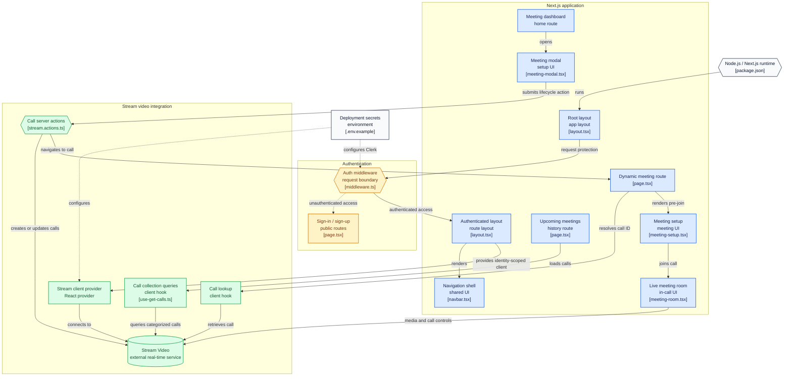

Most side-project video call demos pick a lane - either a quick 1:1 call, or a group meeting room - and skip the parts that make it feel like a real product: authentication, screen sharing, a chat panel that survives the call. Orbit was an exercise in building the *product* around video calling rather than the video calling itself, by leaning on a managed video SDK for the WebRTC plumbing and spending the engineering effort on everything around it.

## Architecture


```mermaid
flowchart TD

subgraph group_next["Next.js application"]
  node_root_layout["Root layout<br/>app layout<br/>[layout.tsx]"]
  node_authenticated_layout["Authenticated layout<br/>route layout<br/>[layout.tsx]"]
  node_product_shell["Navigation shell<br/>shared UI<br/>[navbar.tsx]"]
  node_dashboard["Meeting dashboard<br/>home route"]
  node_meeting_modal["Meeting modal<br/>setup UI<br/>[meeting-modal.tsx]"]
  node_upcoming_view["Upcoming meetings<br/>history route<br/>[page.tsx]"]
  node_meeting_route["Dynamic meeting route<br/>[page.tsx]"]
  node_meeting_setup["Meeting setup<br/>meeting UI<br/>[meeting-setup.tsx]"]
  node_meeting_room["Live meeting room<br/>in-call UI<br/>[meeting-room.tsx]"]
end

subgraph group_auth["Authentication"]
  node_auth_screens["Sign-in / sign-up<br/>public routes<br/>[page.tsx]"]
  node_middleware{{"Auth middleware<br/>request boundary<br/>[middleware.ts]"}}
end

subgraph group_stream["Stream video integration"]
  node_call_actions{{"Call server actions<br/>[stream.actions.ts]"}}
  node_history_queries["Call collection queries<br/>client hook<br/>[use-get-calls.ts]"]
  node_call_lookup["Call lookup<br/>client hook"]
  node_stream_provider["Stream client provider<br/>React provider"]
  node_stream_service[("Stream Video<br/>external real-time service")]
end

node_runtime{{"Node.js / Next.js runtime<br/>[package.json]"}}
node_environment["Deployment secrets<br/>environment<br/>[.env.example]"]

node_runtime -->|"runs"| node_root_layout
node_root_layout -->|"request protection"| node_middleware
node_middleware -.->|"unauthenticated access"| node_auth_screens
node_middleware -->|"authenticated access"| node_authenticated_layout
node_authenticated_layout -->|"renders"| node_product_shell
node_authenticated_layout -->|"provides identity-scoped client"| node_stream_provider
node_stream_provider -->|"connects to"| node_stream_service
node_environment -.->|"configures"| node_stream_provider
node_environment -.->|"configures Clerk"| node_middleware
node_dashboard -->|"opens"| node_meeting_modal
node_meeting_modal -->|"submits lifecycle action"| node_call_actions
node_call_actions -->|"creates or updates calls"| node_stream_service
node_call_actions -->|"navigates to call"| node_meeting_route
node_upcoming_view -->|"loads calls"| node_history_queries
node_history_queries -->|"queries categorized calls"| node_stream_service
node_meeting_route -->|"resolves call ID"| node_call_lookup
node_call_lookup -->|"retrieves call"| node_stream_service
node_meeting_route -->|"renders pre-join"| node_meeting_setup
node_meeting_setup -->|"joins call"| node_meeting_room
node_meeting_room -->|"media and call controls"| node_stream_service

click node_runtime "https://github.com/manish-9245/orbit/blob/main/package.json"
click node_root_layout "https://github.com/manish-9245/orbit/blob/main/app/layout.tsx"
click node_auth_screens "https://github.com/manish-9245/orbit/blob/main/app/(auth)/sign-in/%5B%5B...sign-in%5D%5D/page.tsx"
click node_middleware "https://github.com/manish-9245/orbit/blob/main/middleware.ts"
click node_authenticated_layout "https://github.com/manish-9245/orbit/blob/main/app/(root)/layout.tsx"
click node_product_shell "https://github.com/manish-9245/orbit/blob/main/components/navbar.tsx"
click node_dashboard "https://github.com/manish-9245/orbit/blob/main/components/meeting-type-list.tsx"
click node_meeting_modal "https://github.com/manish-9245/orbit/blob/main/components/modals/meeting-modal.tsx"
click node_call_actions "https://github.com/manish-9245/orbit/blob/main/actions/stream.actions.ts"
click node_history_queries "https://github.com/manish-9245/orbit/blob/main/hooks/use-get-calls.ts"
click node_upcoming_view "https://github.com/manish-9245/orbit/blob/main/app/(root)/(home)/upcoming/page.tsx"
click node_call_lookup "https://github.com/manish-9245/orbit/blob/main/hooks/use-get-call-by-id.ts"
click node_meeting_route "https://github.com/manish-9245/orbit/blob/main/app/(root)/meeting/%5Bid%5D/page.tsx"
click node_meeting_setup "https://github.com/manish-9245/orbit/blob/main/components/meeting-setup.tsx"
click node_meeting_room "https://github.com/manish-9245/orbit/blob/main/components/meeting-room.tsx"
click node_stream_provider "https://github.com/manish-9245/orbit/blob/main/providers/stream-client-provider.tsx"
click node_environment "https://github.com/manish-9245/orbit/blob/main/.env.example"

classDef toneNeutral fill:#f8fafc,stroke:#334155,stroke-width:1.5px,color:#0f172a
classDef toneBlue fill:#dbeafe,stroke:#2563eb,stroke-width:1.5px,color:#172554
classDef toneAmber fill:#fef3c7,stroke:#d97706,stroke-width:1.5px,color:#78350f
classDef toneMint fill:#dcfce7,stroke:#16a34a,stroke-width:1.5px,color:#14532d
classDef toneRose fill:#ffe4e6,stroke:#e11d48,stroke-width:1.5px,color:#881337
classDef toneIndigo fill:#e0e7ff,stroke:#4f46e5,stroke-width:1.5px,color:#312e81
classDef toneTeal fill:#ccfbf1,stroke:#0f766e,stroke-width:1.5px,color:#134e4a
class node_root_layout,node_authenticated_layout,node_product_shell,node_dashboard,node_meeting_modal,node_upcoming_view,node_meeting_route,node_meeting_setup,node_meeting_room toneBlue
class node_auth_screens,node_middleware toneAmber
class node_call_actions,node_history_queries,node_call_lookup,node_stream_provider,node_stream_service toneMint
class node_runtime,node_environment toneNeutral
```

Boxes are clickable and jump straight to the real source file on GitHub.

## What it does

- 1:1 and group video calls with screen sharing and an in-call chat panel, joined straight from a URL.
- A dashboard for starting an instant meeting or scheduling one for later, plus a history view split into upcoming and past calls.
- A pre-join setup screen for checking camera and mic before entering the room, and prebuilt in-call controls (grid or speaker layout, participant list, stats).

## System design

Orbit is built on a managed video layer rather than a hand-rolled WebRTC stack, which is a deliberate scope decision: the app's own code focuses on authentication, routing, and the call experience around the video, not on media negotiation. That's also why the interesting engineering here is about state and auth rather than about codecs.

The one secret that can never reach the browser is the video provider's API secret, so it doesn't: a Next.js Server Action mints a short-lived, user-scoped access token entirely server-side once a signed-in user is confirmed, and the client only ever holds a public key plus a callback that asks the server for a fresh token whenever the video SDK needs one. That's the same "keep the secret on the server" guarantee a REST endpoint would give, without needing to define and version one.

Call history is shaped as one query instead of two: every call the current user created or was invited to comes back in a single request, then gets split client-side into "upcoming" and "past" views. That avoids maintaining two separate endpoints that would otherwise need to stay consistent with each other every time the call model changes.

## Infrastructure

Authentication runs through Clerk, gating every route via middleware before it reaches the authenticated shell. Real-time media, room state, and call persistence are entirely owned by the managed video provider's backend - Orbit itself has no media server or call database to operate, which keeps the deployment surface to a standard Next.js app.

## What's next

- A "personal room" route is already protected by the auth middleware but doesn't have a page built for it yet.

## Running it

```bash
bun install   # or npm install
# .env.local needs a Clerk key pair and a Stream Video key pair -
# check .env.example for the exact variable names before copying from the README
bun dev       # or npm run dev
```
