Following a coding tutorial usually means two windows and constant alt-tabbing: the video in one, the editor in the other, losing your place in both every time you switch. ProgrammerSkool's whole premise is refusing that trade - a YouTube playlist and a real, compiling C++ editor live in the same view, and neither one is a toy.

## Architecture

```mermaid
flowchart TD

subgraph group_legacy["Legacy static site"]
  node_legacy_index["Legacy page<br/>static HTML<br/>[index.html]"]
  node_legacy_script["Legacy script<br/>JavaScript<br/>[script.js]"]
  node_legacy_style["Legacy styles<br/>CSS<br/>[style.css]"]
end

subgraph group_client["Vite React client"]
  node_vite_entry["Vite HTML entry<br/>[index.html]"]
  node_react_entry["React mount<br/>React entry<br/>[main.jsx]"]
  node_app["App composition<br/>React screen<br/>[App.jsx]"]
  node_assets["Static assets<br/>asset source"]
end

subgraph group_ui["UI primitives"]
  node_button["Button<br/>UI primitive<br/>[button.jsx]"]
  node_card["Card<br/>UI primitive<br/>[card.jsx]"]
  node_slider["Slider<br/>UI primitive<br/>[slider.jsx]"]
end

subgraph group_styling["Styling and build"]
  node_app_css["App styles<br/>CSS<br/>[App.css]"]
  node_global_css["Global styles<br/>CSS<br/>[index.css]"]
  node_vite_config["Vite config<br/>build config<br/>[vite.config.js]"]
  node_package["Dependencies<br/>package manifest<br/>[package.json]"]
  node_tailwind["Tailwind config<br/>style config<br/>[tailwind.config.js]"]
  node_postcss["PostCSS config<br/>style config<br/>[postcss.config.js]"]
  node_components_config["Component convention<br/>UI config<br/>[components.json]"]
end

node_browser(("Browser<br/>runtime"))
node_youtube{{"YouTube iframe embed<br/>playlist video, external"}}
node_wandbox{{"wandbox.org/api/compile.json<br/>external - no code execution owned by this project"}}

node_browser -.->|"can load separately"| node_legacy_index
node_legacy_index -->|"loads"| node_legacy_script
node_legacy_index -->|"styles with"| node_legacy_style
node_legacy_index -->|"embeds playlist"| node_youtube
node_legacy_script -->|"POST code, gcc-head, C++17"| node_wandbox
node_browser -->|"loads Vite output"| node_vite_entry
node_vite_entry -->|"loads"| node_react_entry
node_react_entry -->|"mounts"| node_app
node_app -->|"embeds playlist"| node_youtube
node_app -->|"fetch() POST code"| node_wandbox
node_app -->|"composes"| node_button
node_app -->|"composes"| node_card
node_app -->|"composes"| node_slider
node_app -->|"uses"| node_app_css
node_react_entry -->|"uses"| node_global_css
node_app -->|"uses"| node_assets
node_vite_config -->|"builds and serves"| node_vite_entry
node_package -->|"defines tooling"| node_vite_config
node_tailwind -->|"drives utility styling"| node_global_css
node_postcss -->|"processes"| node_global_css
node_components_config -.->|"guides convention"| node_button
node_components_config -.->|"guides convention"| node_card
node_components_config -.->|"guides convention"| node_slider

click node_legacy_index "https://github.com/manish-9245/programmerskool.io/blob/main/index.html"
click node_legacy_script "https://github.com/manish-9245/programmerskool.io/blob/main/script.js"
click node_legacy_style "https://github.com/manish-9245/programmerskool.io/blob/main/style.css"
click node_vite_entry "https://github.com/manish-9245/programmerskool.io/blob/main/programmerskool-vite/index.html"
click node_react_entry "https://github.com/manish-9245/programmerskool.io/blob/main/programmerskool-vite/src/main.jsx"
click node_app "https://github.com/manish-9245/programmerskool.io/blob/main/programmerskool-vite/src/App.jsx"
click node_app_css "https://github.com/manish-9245/programmerskool.io/blob/main/programmerskool-vite/src/App.css"
click node_global_css "https://github.com/manish-9245/programmerskool.io/blob/main/programmerskool-vite/src/index.css"
click node_button "https://github.com/manish-9245/programmerskool.io/blob/main/programmerskool-vite/src/components/ui/button.jsx"
click node_card "https://github.com/manish-9245/programmerskool.io/blob/main/programmerskool-vite/src/components/ui/card.jsx"
click node_slider "https://github.com/manish-9245/programmerskool.io/blob/main/programmerskool-vite/src/components/ui/slider.jsx"
click node_assets "https://github.com/manish-9245/programmerskool.io/tree/main/programmerskool-vite/public"
click node_vite_config "https://github.com/manish-9245/programmerskool.io/blob/main/programmerskool-vite/vite.config.js"
click node_package "https://github.com/manish-9245/programmerskool.io/blob/main/programmerskool-vite/package.json"
click node_tailwind "https://github.com/manish-9245/programmerskool.io/blob/main/programmerskool-vite/tailwind.config.js"
click node_postcss "https://github.com/manish-9245/programmerskool.io/blob/main/programmerskool-vite/postcss.config.js"
click node_components_config "https://github.com/manish-9245/programmerskool.io/blob/main/programmerskool-vite/components.json"

classDef toneNeutral fill:#f8fafc,stroke:#334155,stroke-width:1.5px,color:#0f172a
classDef toneBlue fill:#dbeafe,stroke:#2563eb,stroke-width:1.5px,color:#172554
classDef toneAmber fill:#fef3c7,stroke:#d97706,stroke-width:1.5px,color:#78350f
classDef toneMint fill:#dcfce7,stroke:#16a34a,stroke-width:1.5px,color:#14532d
classDef toneRose fill:#ffe4e6,stroke:#e11d48,stroke-width:1.5px,color:#881337
classDef toneIndigo fill:#e0e7ff,stroke:#4f46e5,stroke-width:1.5px,color:#312e81
classDef toneTeal fill:#ccfbf1,stroke:#0f766e,stroke-width:1.5px,color:#134e4a
class node_legacy_index,node_legacy_script,node_legacy_style toneBlue
class node_vite_entry,node_react_entry,node_app,node_assets toneAmber
class node_button,node_card,node_slider toneMint
class node_app_css,node_global_css,node_vite_config,node_package,node_tailwind,node_postcss,node_components_config toneRose
class node_browser toneNeutral
class node_youtube,node_wandbox toneIndigo
```



Boxes are clickable and jump straight to the real source file on GitHub.

## The compile step is real

The editor isn't just a syntax-highlighted textarea - "Compile and Run" actually sends your code to [Wandbox](https://wandbox.org), a free public compilation API, and prints back whatever the compiler actually says:

```js
// script.js (static version, via jQuery)
$.ajax({
  url: "https://wandbox.org/api/compile.json",
  method: "POST",
  data: JSON.stringify({
    code, compiler: "gcc-head", stdin: "",
    options: "-O2 -Wall -std=c++17 -pedantic-errors",
  }),
});
```

That's a genuine limitation worth naming plainly: there's no backend of its own here, no sandboxed execution owned by this project - if Wandbox is down or rate-limits the request, compiling stops working, and neither version of the app has retry logic or a timeout beyond a generic `catch`. For a learning tool that's a reasonable trade against standing up and securing your own code-execution sandbox, but it's a real dependency, not an implementation detail.

## Two implementations of the same idea

The repository is really two separate builds of the same concept sitting side by side, and it's worth being upfront about that rather than describing only the polished half. The root `index.html` is a plain static site - no bundler, no `package.json` - built on jQuery 3.6.0 and CodeMirror 5, with a hand-rolled draggable split panel:

```js
// script.js
const bar = document.querySelector(".split__bar");
const left = document.querySelector(".split__left");
let mouse_is_down = false;
bar.addEventListener("mousedown", () => { mouse_is_down = true; });
document.addEventListener("mousemove", (e) => {
  if (!mouse_is_down) return;
  left.style.width = `${e.clientX}px`;
});
document.addEventListener("mouseup", () => { mouse_is_down = false; });
```

Sitting in `programmerskool-vite/` is a from-scratch React rewrite: Vite, React 19, CodeMirror 6 via `@uiw/react-codemirror`, Tailwind 4, shadcn-style Radix components. It goes further than the original - a resizable, draggable video window with viewport-boundary clamping, a `requestAnimationFrame`-throttled divider between editor and output with touch support for mobile, `fetch` instead of jQuery for the same Wandbox call. But it isn't wired into the root site at all; there's no build step that produces or links to it. It's an unfinished parallel version, not a refactor-in-progress with a clear migration path yet - the kind of honest, half-done state a lot of side projects actually live in.

## Extracting a playlist ID two different ways

Both versions solve the same small problem - pull a playlist ID out of a pasted YouTube URL - and solve it with two different regexes, which is itself a small tell that the React version was written independently rather than ported line-by-line from the original:

```js
// static version - lookbehind
const id = url.match(/(?<=list=)[^&/?]+/)[0];

// React version - capture group
const id = url.match(/[?&]list=([^&]+)/)[1];
```

Same result, different style - a reminder that "rewrite this in React" rarely means "translate the same logic," it usually means someone re-derives the logic from scratch against the same requirement.

## Running it

The root site needs nothing beyond opening `index.html` - no build step, no dependencies to install. The in-progress rewrite has its own `package.json` and a standard Vite `dev` / `build` / `preview` set, runnable independently from `programmerskool-vite/`.
