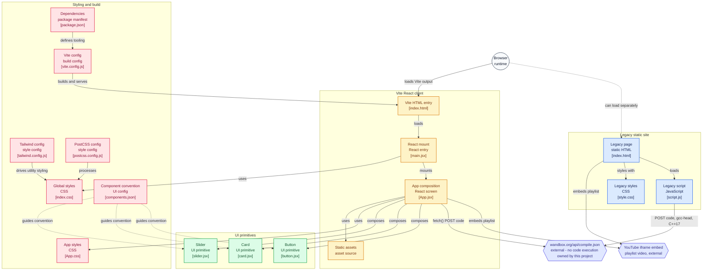

Following a coding tutorial usually means two windows and constant alt-tabbing: the video in one, the editor in the other, losing your place in both every time you switch. ProgrammerSkool's whole premise is refusing that trade - a YouTube playlist and a real, compiling C++ editor live in the same view, and neither one is a toy.

## Architecture

```mermaid
flowchart TD

subgraph group_legacy["Legacy static site"]
  node_legacy_index["Legacy page<br/>static HTML<br/>[index.html]"]
  node_legacy_script["Legacy script<br/>JavaScript<br/>[script.js]"]
  node_legacy_style["Legacy styles<br/>CSS<br/>[style.css]"]
end

subgraph group_client["Vite React client"]
  node_vite_entry["Vite HTML entry<br/>[index.html]"]
  node_react_entry["React mount<br/>React entry<br/>[main.jsx]"]
  node_app["App composition<br/>React screen<br/>[App.jsx]"]
  node_assets["Static assets<br/>asset source"]
end

subgraph group_ui["UI primitives"]
  node_button["Button<br/>UI primitive<br/>[button.jsx]"]
  node_card["Card<br/>UI primitive<br/>[card.jsx]"]
  node_slider["Slider<br/>UI primitive<br/>[slider.jsx]"]
end

subgraph group_styling["Styling and build"]
  node_app_css["App styles<br/>CSS<br/>[App.css]"]
  node_global_css["Global styles<br/>CSS<br/>[index.css]"]
  node_vite_config["Vite config<br/>build config<br/>[vite.config.js]"]
  node_package["Dependencies<br/>package manifest<br/>[package.json]"]
  node_tailwind["Tailwind config<br/>style config<br/>[tailwind.config.js]"]
  node_postcss["PostCSS config<br/>style config<br/>[postcss.config.js]"]
  node_components_config["Component convention<br/>UI config<br/>[components.json]"]
end

node_browser(("Browser<br/>runtime"))
node_youtube{{"YouTube iframe embed<br/>playlist video, external"}}
node_wandbox{{"wandbox.org/api/compile.json<br/>external - no code execution owned by this project"}}

node_browser -.->|"can load separately"| node_legacy_index
node_legacy_index -->|"loads"| node_legacy_script
node_legacy_index -->|"styles with"| node_legacy_style
node_legacy_index -->|"embeds playlist"| node_youtube
node_legacy_script -->|"POST code, gcc-head, C++17"| node_wandbox
node_browser -->|"loads Vite output"| node_vite_entry
node_vite_entry -->|"loads"| node_react_entry
node_react_entry -->|"mounts"| node_app
node_app -->|"embeds playlist"| node_youtube
node_app -->|"fetch() POST code"| node_wandbox
node_app -->|"composes"| node_button
node_app -->|"composes"| node_card
node_app -->|"composes"| node_slider
node_app -->|"uses"| node_app_css
node_react_entry -->|"uses"| node_global_css
node_app -->|"uses"| node_assets
node_vite_config -->|"builds and serves"| node_vite_entry
node_package -->|"defines tooling"| node_vite_config
node_tailwind -->|"drives utility styling"| node_global_css
node_postcss -->|"processes"| node_global_css
node_components_config -.->|"guides convention"| node_button
node_components_config -.->|"guides convention"| node_card
node_components_config -.->|"guides convention"| node_slider

click node_legacy_index "https://github.com/manish-9245/programmerskool.io/blob/main/index.html"
click node_legacy_script "https://github.com/manish-9245/programmerskool.io/blob/main/script.js"
click node_legacy_style "https://github.com/manish-9245/programmerskool.io/blob/main/style.css"
click node_vite_entry "https://github.com/manish-9245/programmerskool.io/blob/main/programmerskool-vite/index.html"
click node_react_entry "https://github.com/manish-9245/programmerskool.io/blob/main/programmerskool-vite/src/main.jsx"
click node_app "https://github.com/manish-9245/programmerskool.io/blob/main/programmerskool-vite/src/App.jsx"
click node_app_css "https://github.com/manish-9245/programmerskool.io/blob/main/programmerskool-vite/src/App.css"
click node_global_css "https://github.com/manish-9245/programmerskool.io/blob/main/programmerskool-vite/src/index.css"
click node_button "https://github.com/manish-9245/programmerskool.io/blob/main/programmerskool-vite/src/components/ui/button.jsx"
click node_card "https://github.com/manish-9245/programmerskool.io/blob/main/programmerskool-vite/src/components/ui/card.jsx"
click node_slider "https://github.com/manish-9245/programmerskool.io/blob/main/programmerskool-vite/src/components/ui/slider.jsx"
click node_assets "https://github.com/manish-9245/programmerskool.io/tree/main/programmerskool-vite/public"
click node_vite_config "https://github.com/manish-9245/programmerskool.io/blob/main/programmerskool-vite/vite.config.js"
click node_package "https://github.com/manish-9245/programmerskool.io/blob/main/programmerskool-vite/package.json"
click node_tailwind "https://github.com/manish-9245/programmerskool.io/blob/main/programmerskool-vite/tailwind.config.js"
click node_postcss "https://github.com/manish-9245/programmerskool.io/blob/main/programmerskool-vite/postcss.config.js"
click node_components_config "https://github.com/manish-9245/programmerskool.io/blob/main/programmerskool-vite/components.json"

classDef toneNeutral fill:#f8fafc,stroke:#334155,stroke-width:1.5px,color:#0f172a
classDef toneBlue fill:#dbeafe,stroke:#2563eb,stroke-width:1.5px,color:#172554
classDef toneAmber fill:#fef3c7,stroke:#d97706,stroke-width:1.5px,color:#78350f
classDef toneMint fill:#dcfce7,stroke:#16a34a,stroke-width:1.5px,color:#14532d
classDef toneRose fill:#ffe4e6,stroke:#e11d48,stroke-width:1.5px,color:#881337
classDef toneIndigo fill:#e0e7ff,stroke:#4f46e5,stroke-width:1.5px,color:#312e81
classDef toneTeal fill:#ccfbf1,stroke:#0f766e,stroke-width:1.5px,color:#134e4a
class node_legacy_index,node_legacy_script,node_legacy_style toneBlue
class node_vite_entry,node_react_entry,node_app,node_assets toneAmber
class node_button,node_card,node_slider toneMint
class node_app_css,node_global_css,node_vite_config,node_package,node_tailwind,node_postcss,node_components_config toneRose
class node_browser toneNeutral
class node_youtube,node_wandbox toneIndigo
```

Boxes are clickable and jump straight to the real source file on GitHub.

## What it does

- A synced playlist-and-editor view: pick a YouTube coding playlist, follow along, and write real C++ in the same screen - no alt-tabbing between a video and an IDE.
- "Compile and Run" sends your code to a real compiler and prints back the actual compiler output, not a simulated result.
- A draggable split panel so you control how much screen the video versus the editor gets.

## System design

Compilation is real but not self-hosted: code is sent to a free public compilation API and the response is rendered as-is. That's a deliberate trade against standing up and securing an owned code-execution sandbox - the right call for a learning tool, at the cost of a hard dependency on a third party's uptime and rate limits, with no fallback if it's unavailable.

The repository actually holds two parallel builds of the same idea, and it's worth being upfront about that rather than only describing the polished half. A static original - no bundler, no build step - is what's live today. Sitting alongside it is a from-scratch React rewrite with a more capable UI: a resizable, draggable video window, a smoother touch-friendly divider between editor and output, and the same compile flow reimplemented independently rather than ported line-by-line. It goes further than the original in a few places, but it isn't wired into the live site yet.

## Infrastructure

The live site is a static build with no backend of its own - no server, no database, and no build step required to run it locally; open the HTML file and it works. The React rewrite has its own independent Vite toolchain, developed in parallel rather than replacing the static site.

## What's next

- Wiring the React rewrite into the live site is the main open item - right now it's a fully separate, unfinished build sitting next to the original.
- Compilation depends entirely on a third-party API with no fallback if it's unavailable.

## Running it

The root site needs nothing beyond opening `index.html` - no build step, no dependencies to install. The in-progress rewrite has its own `package.json` and a standard Vite `dev` / `build` / `preview` set, runnable independently.
