A currency converter that only knows the spot exchange rate answers the wrong question. It'll tell you $100 is about 8,300 rupees, but not what $100 actually *buys* in each place - which is almost always what you're really trying to compare, whether that's a salary offer or the cost of living somewhere new. Purchasing power parity fixes that by converting through "international dollars" instead of the raw FX rate.

## Architecture

```mermaid
flowchart TD

subgraph group_consumers["Consumers"]
  node_library_user(("CommonJS consumer"))
  node_cli_user(("CLI user<br/>consumer"))
end

subgraph group_package["npm Package"]
  node_npm{{"npm distribution<br/>registry"}}
  node_package_manifest["Package manifest<br/>npm manifest<br/>[package.json]"]
  node_lockfile["Dependency lockfile<br/>npm lockfile<br/>[package-lock.json]"]
  node_cli_command["ppp-calculator<br/>CLI command<br/>[index.js]"]
end

subgraph group_conversion["Conversion Engine"]
  node_module_api["Public CommonJS API<br/>module exports<br/>[index.js]"]
  node_code_validation["ISO3 normalization<br/>validation layer<br/>[index.js]"]
  node_ppp_resolution[("PPP data resolution<br/>in-memory cache, no disk persistence<br/>[index.js]")]
  node_ppp_calculation["PPP calculation<br/>calculation layer<br/>[index.js]"]
  node_metadata_lookup["Country &amp; currency metadata<br/>metadata layer<br/>[index.js]"]
  node_conversion_response["Conversion response<br/>API result<br/>[index.js]"]
  node_country_lists["Country lookup results<br/>API result<br/>[index.js]"]
end

subgraph group_external["External dependency"]
  node_ppp_dataset{{"datasets/ppp CSV<br/>raw.githubusercontent.com - fetched live, not bundled"}}
end

node_npm -->|"publishes from"| node_package_manifest
node_package_manifest -->|"locks dependencies with"| node_lockfile
node_package_manifest -->|"registers bin"| node_cli_command
node_library_user -->|"require&#40;&#41;"| node_module_api
node_cli_user -->|"invokes"| node_cli_command
node_cli_command -->|"uses conversion"| node_module_api
node_module_api -->|"convertPPP"| node_code_validation
node_code_validation -->|"valid codes"| node_ppp_resolution
node_ppp_resolution -->|"fetches fresh on cold start"| node_ppp_dataset
node_ppp_resolution -->|"PPP values"| node_ppp_calculation
node_ppp_calculation -->|"amount results"| node_metadata_lookup
node_metadata_lookup -->|"enriched records"| node_conversion_response
node_module_api -->|"listCountries / listCountryCodes"| node_country_lists
node_metadata_lookup -->|"country records"| node_country_lists
node_cli_command -->|"JSON with names and flags"| node_conversion_response

click node_package_manifest "https://github.com/manish-9245/purchasing-power-parity-advanced/blob/main/package.json"
click node_lockfile "https://github.com/manish-9245/purchasing-power-parity-advanced/blob/main/package-lock.json"
click node_cli_command "https://github.com/manish-9245/purchasing-power-parity-advanced/blob/main/index.js"
click node_module_api "https://github.com/manish-9245/purchasing-power-parity-advanced/blob/main/index.js"
click node_code_validation "https://github.com/manish-9245/purchasing-power-parity-advanced/blob/main/index.js"
click node_ppp_resolution "https://github.com/manish-9245/purchasing-power-parity-advanced/blob/main/index.js"
click node_ppp_calculation "https://github.com/manish-9245/purchasing-power-parity-advanced/blob/main/index.js"
click node_metadata_lookup "https://github.com/manish-9245/purchasing-power-parity-advanced/blob/main/index.js"
click node_conversion_response "https://github.com/manish-9245/purchasing-power-parity-advanced/blob/main/index.js"
click node_country_lists "https://github.com/manish-9245/purchasing-power-parity-advanced/blob/main/index.js"

classDef toneNeutral fill:#f8fafc,stroke:#334155,stroke-width:1.5px,color:#0f172a
classDef toneBlue fill:#dbeafe,stroke:#2563eb,stroke-width:1.5px,color:#172554
classDef toneAmber fill:#fef3c7,stroke:#d97706,stroke-width:1.5px,color:#78350f
classDef toneMint fill:#dcfce7,stroke:#16a34a,stroke-width:1.5px,color:#14532d
classDef toneRose fill:#ffe4e6,stroke:#e11d48,stroke-width:1.5px,color:#881337
classDef toneIndigo fill:#e0e7ff,stroke:#4f46e5,stroke-width:1.5px,color:#312e81
classDef toneTeal fill:#ccfbf1,stroke:#0f766e,stroke-width:1.5px,color:#134e4a
class node_library_user,node_cli_user toneBlue
class node_npm,node_package_manifest,node_lockfile,node_cli_command toneAmber
class node_module_api,node_code_validation,node_ppp_resolution,node_ppp_calculation,node_metadata_lookup,node_conversion_response,node_country_lists toneMint
class node_ppp_dataset toneRose
```



Boxes are clickable and jump straight to the real source file on GitHub.

## What it does

- Converts an amount from one country's currency into another's, adjusted for purchasing power rather than the spot exchange rate - so a salary or cost-of-living comparison reflects what money actually buys locally, not just what it trades for.
- Works both ways from the same package: `require()` it as a library (`convertPPP`, `listCountries`, `listCountryCodes`) or install it globally and use the `ppp-calculator` CLI directly.
- Looks up country and currency metadata - names, flags, currency symbols - alongside the converted figures, so a result is ready to display without a second lookup.

## System design

The conversion itself goes through a currency-neutral "international dollar": divide by the origin country's PPP factor, then multiply by the target country's - the same two-step math regardless of which countries are involved, with country and currency metadata layered on around it.

The one decision worth calling out is where the numbers come from: no PPP data ships inside the package. It fetches a live PPP-to-GDP dataset from a public, GitHub-hosted CSV on first use each run, keeps only the most recent year per country, and memoizes that result for the life of the process. That's a deliberate trade - the figures can never go stale from an outdated bundled copy - at the cost of a hard runtime dependency on a URL the package doesn't control, with no offline fallback if that dataset ever moves or changes shape.

## Infrastructure

Published on npm with zero required configuration - install and go, no API keys, no server to run, no database. The only external dependency at runtime is the one dataset fetch; `engines.node >= 14` is the sole version constraint.

## Installing it

```bash
npm install -g purchasing-power-parity-advanced
ppp-calculator USA 100 CAN,GBR,IND
```

Or as a dependency: `npm install purchasing-power-parity-advanced` and `require()` the same `convertPPP` function directly.
