A single "does everything" service can't credibly prove either claim: something fast enough to chase huge throughput numbers has no business hashing passwords and writing to a database on the hot path, and something doing real auth work has no business skipping the checks that cost CPU. So this repo ships two services instead of one, each built to win a different, incompatible argument - plus a Next.js site that fires real requests at both from your browser instead of just describing them.

## Architecture

```mermaid
flowchart TD

subgraph group_perf["perf-api — throughput"]
  node_perf_app{{"Boot entry<br/>WebFlux app<br/>[PerfApiApplication.java]"}}
  node_ping["Benchmark target<br/>no I/O, no alloc<br/>[PingController.java]"]
  node_echo["Serialization proof<br/>echoes input<br/>[EchoController.java]"]
  node_hash["Real CPU work<br/>SHA-256 hashing<br/>[HashController.java]"]
  node_perf_log["Correlation IDs<br/>structured JSON logs<br/>[RequestLoggingFilter.java]"]
end

subgraph group_secure["secure-api — auth & rate limiting"]
  node_secure_app{{"Boot entry<br/>Spring Security app<br/>[SecureApiApplication.java]"}}
  node_auth_ctrl["Login, register, refresh<br/>auth endpoints<br/>[AuthController.java]"]
  node_auth_svc["bcrypt + rotation + lockout<br/>auth logic<br/>[AuthService.java]"]
  node_jwt["Access tokens, 15min TTL<br/>JWT issuance &amp; verification<br/>[JwtService.java]"]
  node_ratelimit["Token-bucket check<br/>rate-limit filter<br/>[RateLimitFilter.java]"]
  node_protected["RBAC-gated resources<br/>user &amp; admin endpoints<br/>[UserController.java]"]
  node_repo[("Users &amp; refresh tokens<br/>JPA repositories")]
end

subgraph group_web["web — Next.js playground"]
  node_playground["Live playground<br/>calls real services<br/>[playground/page.tsx]"]
  node_docs["API reference<br/>docs page<br/>[docs/page.tsx]"]
  node_arch["This diagram, rendered<br/>architecture page<br/>[architecture/page.tsx]"]
end

node_postgres[("PostgreSQL<br/>via Flyway")]
node_redis[("Redis<br/>token buckets")]
node_prometheus["Prometheus<br/>metrics scrape"]
node_grafana["Grafana<br/>dashboards"]
node_railway{{"Railway<br/>3 services, 1 repo"}}

node_playground -->|"fires live requests"| node_ping
node_playground -->|"fires live requests"| node_auth_ctrl
node_perf_app -->|"boots"| node_ping
node_perf_app -->|"boots"| node_echo
node_perf_app -->|"boots"| node_hash
node_ping -.->|"tagged &amp; logged"| node_perf_log
node_echo -.->|"tagged &amp; logged"| node_perf_log
node_hash -.->|"tagged &amp; logged"| node_perf_log
node_secure_app -->|"boots"| node_auth_ctrl
node_secure_app -->|"boots"| node_ratelimit
node_auth_ctrl -->|"validates &amp; hashes"| node_auth_svc
node_auth_svc -->|"issues"| node_jwt
node_auth_svc -->|"persists"| node_repo
node_repo -->|"reads/writes"| node_postgres
node_jwt -->|"guards every request"| node_protected
node_ratelimit -->|"token-bucket"| node_redis
node_ratelimit -.->|"anonymous 20/min"| node_auth_ctrl
node_ratelimit -.->|"authenticated 100/min"| node_protected
node_perf_app -.->|"/actuator/prometheus"| node_prometheus
node_secure_app -.->|"/actuator/prometheus"| node_prometheus
node_prometheus -->|"scraped by"| node_grafana
node_railway -.->|"hosts"| node_perf_app
node_railway -.->|"hosts"| node_secure_app
node_railway -.->|"hosts"| node_playground

click node_perf_app "https://github.com/manish-9245/scalable-api/blob/main/perf-api/src/main/java/com/scalableapi/perfapi/PerfApiApplication.java"
click node_ping "https://github.com/manish-9245/scalable-api/blob/main/perf-api/src/main/java/com/scalableapi/perfapi/web/PingController.java"
click node_echo "https://github.com/manish-9245/scalable-api/blob/main/perf-api/src/main/java/com/scalableapi/perfapi/web/EchoController.java"
click node_hash "https://github.com/manish-9245/scalable-api/blob/main/perf-api/src/main/java/com/scalableapi/perfapi/web/HashController.java"
click node_perf_log "https://github.com/manish-9245/scalable-api/blob/main/perf-api/src/main/java/com/scalableapi/perfapi/web/RequestLoggingFilter.java"
click node_secure_app "https://github.com/manish-9245/scalable-api/blob/main/secure-api/src/main/java/com/scalableapi/secureapi/SecureApiApplication.java"
click node_auth_ctrl "https://github.com/manish-9245/scalable-api/blob/main/secure-api/src/main/java/com/scalableapi/secureapi/auth/AuthController.java"
click node_auth_svc "https://github.com/manish-9245/scalable-api/blob/main/secure-api/src/main/java/com/scalableapi/secureapi/auth/AuthService.java"
click node_jwt "https://github.com/manish-9245/scalable-api/blob/main/secure-api/src/main/java/com/scalableapi/secureapi/security/JwtService.java"
click node_ratelimit "https://github.com/manish-9245/scalable-api/blob/main/secure-api/src/main/java/com/scalableapi/secureapi/ratelimit/RateLimitFilter.java"
click node_protected "https://github.com/manish-9245/scalable-api/blob/main/secure-api/src/main/java/com/scalableapi/secureapi/user/UserController.java"
click node_repo "https://github.com/manish-9245/scalable-api/blob/main/secure-api/src/main/java/com/scalableapi/secureapi/repository/UserRepository.java"
click node_playground "https://github.com/manish-9245/scalable-api/blob/main/web/src/app/playground/page.tsx"
click node_docs "https://github.com/manish-9245/scalable-api/blob/main/web/src/app/docs/page.tsx"
click node_arch "https://github.com/manish-9245/scalable-api/blob/main/web/src/app/architecture/page.tsx"

classDef toneNeutral fill:#f8fafc,stroke:#334155,stroke-width:1.5px,color:#0f172a
classDef toneBlue fill:#dbeafe,stroke:#2563eb,stroke-width:1.5px,color:#172554
classDef toneAmber fill:#fef3c7,stroke:#d97706,stroke-width:1.5px,color:#78350f
classDef toneMint fill:#dcfce7,stroke:#16a34a,stroke-width:1.5px,color:#14532d
classDef toneRose fill:#ffe4e6,stroke:#e11d48,stroke-width:1.5px,color:#881337
classDef toneIndigo fill:#e0e7ff,stroke:#4f46e5,stroke-width:1.5px,color:#312e81
class node_perf_app,node_ping,node_echo,node_hash,node_perf_log toneBlue
class node_secure_app,node_auth_ctrl,node_auth_svc,node_jwt,node_ratelimit,node_protected toneRose
class node_repo,node_postgres,node_redis toneAmber
class node_playground,node_docs,node_arch toneNeutral
class node_prometheus,node_grafana,node_railway toneMint
```



Boxes are clickable and jump straight to the real source file on GitHub.

## perf-api — chasing the ceiling

`perf-api` runs on WebFlux over Netty instead of Servlet/Tomcat, so there's no thread-per-request ceiling to hit. `GET /api/v1/ping` is the benchmark target - no I/O, no allocation beyond the response record. `GET /api/v1/echo/{value}` exists to prove the service is actually serializing a real payload, not just returning a constant. `POST /api/v1/hash` does genuine SHA-256 CPU work so the benchmark isn't secretly measuring a no-op. Compression is explicitly off - it's a CPU tax this service would rather spend on requests - and `jackson-module-afterburner` speeds up (de)serialization. There's no auth, no persistence, no Redis: nothing on the hot path that isn't the request itself.

## secure-api — spending the budget on safety

`secure-api` makes the opposite trade. Access tokens are short-lived JWTs (15 min), but refresh tokens are never JWTs - they're random 256-bit values stored only as a SHA-256 hash, so a database read alone can't be replayed. Every refresh rotates the token; if a *revoked* refresh token is ever presented again, that's a stolen-token replay, and every session for that user gets revoked immediately, not just the one request. Passwords are bcrypt (strength 12) with account lockout after 5 failed logins. RBAC (`ROLE_USER` / `ROLE_ADMIN`) is enforced in the security filter chain, not scattered through controllers. Rate limiting runs on Bucket4j against Redis - a real distributed token bucket, so every instance behind a load balancer consumes from the same bucket instead of its own in-memory count - at two tiers picked automatically by whether the request carries a valid JWT: 20 req/min anonymous (covers brute-force attempts on `/auth/**`), 100 req/min authenticated. The service also runs on virtual threads, since unlike `perf-api` it does real blocking JPA and Redis I/O.

Every request on both services gets an id - reused from an inbound `X-Request-Id` header or generated fresh - echoed back in the response and pushed into one structured JSON log line per request. On `secure-api` that id lands in SLF4J MDC before the request reaches the security filter chain, so an auth failure, a lockout, and a rate-limit rejection for the same request all carry the same id. Given an `X-Request-Id` from a bug report, `grep` finds the whole story in one pass.

## The benchmark that doesn't cheat

The README commits raw k6 output instead of asserting numbers, and the two runs tell an honest story rather than a flattering one. Locally, `docker compose up` with the load generator sharing CPU with the containers under test hits **30,000 req/s sustained** against `/ping`, 0.00% failures, 8.2ms average latency - but that number is explicitly framed as an architectural property (non-blocking event loop, zero allocation, no shared mutable state), not something a single laptop can actually produce credibly.

The number that matters more: the same unmodified script against the **live single-container Railway deployment**, over the real public internet. At the original 30,000 req/s target the container saturates and 14.2% of requests fail. Right-sized to what one container can actually take, it's **400 req/s, 0.00% failures, p95 217ms** - and that's reported as the real headline, not the local one. Bumping `perf-api` to 3 Railway replicas and re-running the identical benchmark gets 550 req/s, **+37%, not +200%** - because the containers were never the only bottleneck in that path (Railway's shared edge/proxy layer, per-connection TLS/DNS, and a single k6 client all sit outside the replica count). That's a genuine measurement, not a marketing multiplier.

`secure-api`'s rate limiter gets the same treatment: 30 anonymous requests against a 20/min limit return exactly 20 allowed / 10 limited, matching the configured capacity exactly. The authenticated version turns up a subtler, correct behavior - over the public internet, 110 sequential requests take long enough (~14s) that Bucket4j's continuous greedy refill adds tokens back mid-burst, so slightly more than 100 succeed. Not a bug in the limiter; the token-bucket algorithm working exactly as designed, visible only once requests are slow enough to spread across real time.

## What's still ongoing

This repo is three days old and under active development, not a finished write-up of a settled system. Both APIs and the playground are already live on Railway - three services, one repo, `secure-api` wired to Railway's managed Postgres and Redis via variable references - but the roadmap (tracked as open issues on the repo) is still moving: more load-test scenarios, more of the playground's live-request surface, and closing the gap between the 30k local ceiling and what a horizontally-scaled Railway deployment can actually sustain.

## Running it

```bash
docker compose up --build
```

Starts everything: `perf-api` (`:8081`), `secure-api` (`:8082`, with Postgres + Redis), Prometheus (`:9090`), Grafana (`:3000`, anonymous viewer access), and the `web` site (`:3100`) wired against the two local services. To iterate on one service directly against `mvn` instead: `docker compose up postgres redis`, then `cd secure-api && mvn spring-boot:run` (or `perf-api`). For the frontend alone: `cd web && npm install && npm run dev`.
