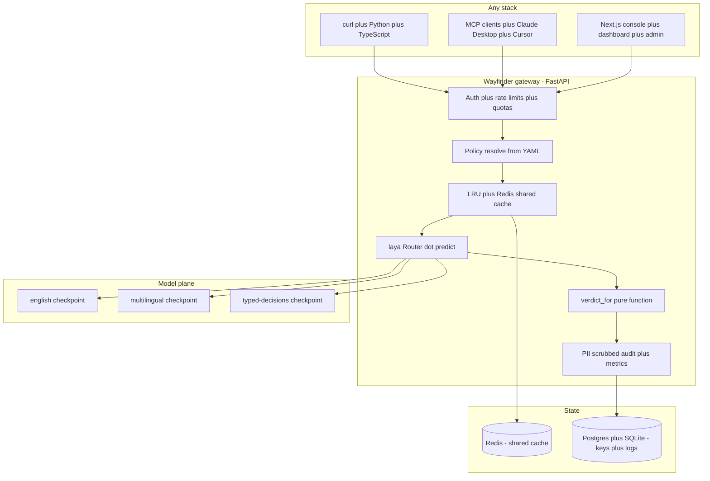

Every agent needs a judge that answers in milliseconds and costs nothing per call and never invents a new output shape. Frontier LLMs can judge but they charge per token and stream text token by token and need parsing on every response. Wayfinder is the opposite bet. It is a self-hosted gateway around the open laya decision model that turns any text into **typed Choice plus Score plus Noul answers** plus a **policy verdict** in about **33 ms per decision** with **zero dollars self-hosted** and **nothing to parse**.

This repo holds zero model code. Weights and forward passes live in the managed laya plane installed with pip. Wayfinder is the infrastructure around it. Validation plus policy thresholds plus cache plus auth plus observability plus UI plus MCP. Stateless by design so any stack can call it over plain HTTP.

## What it does in one call

Send state to a named policy. Get answers plus verdict plus confidence plus routing metadata back.

```bash
curl localhost:8000/v1/decide/support_inbound \
  -H content-type:application/json \
  -d '{"state": {"body": "Billed twice, refund today or we cancel"}}'
```

```json
{
  "policy": "support_inbound",
  "verdict": {"verdict": "act", "confidence": 0.89, "trigger": "refund_requested"},
  "thresholds": {"auto_act_above": 0.85, "escalate_below": 0.6},
  "cache_hit": false
}
```

Safety policies return **allow plus review plus block**. Routing policies return **act plus review plus escalate**. Code branches on the verdict. No string parsing. No schema repair.

```python
import httpx

r = httpx.post(
  "http://localhost:8000/v1/decide/support_inbound",
  json={"state": {"body": text}},
  timeout=60
).json()

if r["verdict"]["verdict"] == "act":
  route_automatically(r)
else:
  escalate_to_human(r)
```

## Shape



## Why this shape

**Zero model code in the request path.** Weights live in laya. The gateway is glue. Validation plus thresholds plus cache plus auth plus observability. That keeps the service boring and fast and easy to scale.

**Stateless equals scalable.** The request carries everything. State plus policy plus overrides. No sessions. No sticky load balancers. Replicas share nothing except optional Redis. Scale with container count not threads.

**One Router per worker preloaded.** Cold checkpoint build costs seconds. Language detection costs microseconds. Setting preload to 1 pays the build at boot behind a readiness gate so p50 stays near inference cost. About **33 ms on GPU** and about **200 to 450 ms on CPU**.

**Cache before torch.** Lookup key is sha256 of state plus questions plus model. First check in-process LRU with **2048 entries** then Redis with **1 hour TTL**. Repeated traffic never touches the GPU. Spam waves plus retries plus pollers collapse to microseconds.

**Batch at the edge.** Batch endpoint takes up to **128 states** with one questions schema. It routes once plus groups by checkpoint plus schema plus calls shared forward passes. That lands near **1 ms per question batched** against about 10 ms solo on GPU.

## Request lifecycle

1. Auth with session plus service key plus master bearer plus per IP and per identity rate limits plus body cap plus state caps
2. Policy resolve from YAML loaded once at boot plus per call threshold overrides
3. Cache lookup. On hit return with cache hit true and skip the model
4. On miss run Router dot predict outside any global lock plus store LRU plus Redis plus verdict plus scrubbed audit plus metrics
5. Emit verdict. Safety policies emit allow or review or block. Routing policies emit act or review or escalate

Failure is explicit. Router not ready returns 503 so probes hold traffic until preload finishes. Bad schema returns 422 naming the policy plus question plus fix. Oversize body returns 413 before tokenization as an OOM guard. Redis down ticks a metric and falls back to local state as degraded not down.

## Eleven reviewed policies

Policies live in wayfinder policies YAML. Each bundle is description plus thresholds plus questions in Choice plus Score plus Noul schema. A policy never holds weights or hostnames so it stays portable across laptop plus Docker plus Kubernetes.

- **llm_firewall** - block jailbreaks plus injections plus secret leaks before they reach your LLM
- **support_inbound** - triage any ticket in any language with department plus urgency plus churn plus refund
- **model_router** - route each request to small local model plus frontier model plus human
- **content_safety** - score toxicity plus threats plus severity
- **lead_scoring** - score need plus timeline plus authority plus budget with low confidence mapped to warm never cold
- **seo_internal_link** - judge source plus candidate pairs for honest link fit with no invented URLs
- **seo_intent** - classify query intent across informational plus commercial plus transactional plus navigational plus support
- **seo_audit** - vote keep plus refresh plus merge plus remove with freshness score
- **seo_prospect** - score relevance plus message fit for outreach
- **seo_gate** - pre publish trio of intent match plus grounded plus links sane
- **seo_answer** - score one page against one buyer question

Thresholds are fully optional per call. Omit for policy defaults or pass auto act above plus escalate below between 0 and 1. Overrides never mutate global state. Start at **0.85 plus 0.60** then measure escalation precision for a week then tune per policy.

```yaml
policies:
  my_flow:
    description: "What this gate protects."
    auto_act_above: 0.85
    escalate_below: 0.60
    questions:
      dept:
        type: choice
        instructions: "Which team owns this?"
        criteria: {billing: "invoices plus refunds", tech: "bugs plus outages"}
      risk:
        type: noul
        instructions: "Is this risky or irreversible?"
```

## Bulk scoring to CSV

Seven policies cover Jev style bulk work. One lead scorer plus six SEO jobs. The model judges text. Weights plus firmographic fit plus date math stay in your code.

```bash
python examples/lead_scoring.py leads.json --out scored.csv
python examples/seo_bulk.py internal_link --out links.csv
python examples/seo_bulk.py intent --input queries.json --out intent.csv
```

Batch 128 rows per predict batch call. Each row returns answers plus verdict plus confidence ready for CSV. Lead rows below **0.5 confidence** land warm and ask the qualifying question. SEO rows queue for editor review. **Low confidence never forces a decision.**

## Endpoints

- **POST v1 decide policy** - named policy with YAML questions plus thresholds plus verdict. The workhorse
- **POST v1 systemone** - Jev compatible passthrough. Existing Jev clients repoint base URL here unchanged
- **POST predict** - raw state plus questions with auto routing by language in under 1 ms
- **POST predict batch** - 1 to 128 states with shared forward passes plus per row verdict when policy is set
- **GET policies** - catalogue plus full schemas for builders with full flag
- **GET health plus metrics** - readiness probe plus hit rate plus latency plus block counters. Scrape it
- **GET docs** - OpenAPI playground local only and disabled in prod
- **POST mcp** - hosted MCP endpoint over Streamable HTTP with trailing slash

```bash
curl $WF_URL/predict/batch \
  -H "authorization: Bearer $WF_KEY" \
  -H content-type:application/json \
  -d '{"states": [{"body": "refund pls"}, {"body": "server down"}], "policy": "support_inbound"}'
```

## Platform beyond inference

Wayfinder ships a full platform layer not just inference.

**Managed auth** with self-hosted SuperTokens for email plus password plus optional Google plus GitHub OAuth. Zero passwords in the repo. Keyless dev admin mode when unconfigured.

**Service tokens** as per user wf keys hashed at rest and shown once and revocable from dashboard or delete endpoint.

**Per user metrics and logs** on dashboard with requests plus hit rate plus p95 plus quota plus filterable scrubbed request log.

**Rate limiting plus quotas** per key plus per user plus per IP tiered by plan. Free at **60 per min**. Pro at **600 per min**. Enterprise unlimited. Monthly quotas at **10000 free** and **500000 pro** with 429 plus Retry After.

**Super admin console** at admin path with global overview plus users plus roles plus plans plus quotas plus keys plus platform logs plus system health.

## Calibration honesty

Laya probabilities come from proper scoring rules with temperature fitting. Base ECE drops from **0.466 to 0.081 on English**. Multilingual ships uncalibrated. Fit temperatures on your own held out data before trusting auto act for irreversible actions.

Gate on **confidence never on raw act probability** which reads near 1.0 for almost every input upstream. This is the most common integration mistake and the docs call it out directly.

## Deploy

```bash
docker compose up --build
```

That starts gate plus Redis with models cached in a volume. Env contract covers device plus preload plus models plus threads at or below physical cores plus API key plus Redis URL. Production uses Postgres. Local dev stays on SQLite.

Railway ships two services. API only from repo root Dockerfile. Next.js frontend from web dir. Health check hits health path with 300 second timeout and restart on failure.

## Links

- [Live app](https://wayfinder.buildwithmanish.com)
- [Console](https://wayfinder.buildwithmanish.com/console)
- [Dashboard](https://wayfinder.buildwithmanish.com/dashboard)
- [Policies](https://wayfinder.buildwithmanish.com/policies)
- [Product blog](https://wayfinder.buildwithmanish.com/blog)
- [Backend API](https://wayfinder-backend.buildwithmanish.com)
- [Health](https://wayfinder-backend.buildwithmanish.com/health)
- [Metrics](https://wayfinder-backend.buildwithmanish.com/metrics)
- [Repo](https://github.com/manish-9245/Wayfinder)
- [laya model](https://huggingface.co/convaiinnovations/laya)
- [SuperTokens](https://supertokens.com)
